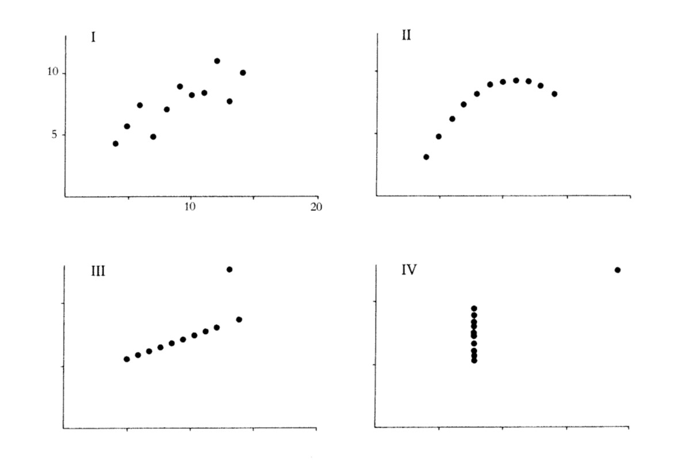

```{R, setup, include = F}
library(pacman)

p_load(here, MASS, tidyverse, ggplot2, xaringan, knitr, kableExtra, foreign, broom, xaringanthemer)


i_am("slides/EDLD_650_1_intro.rmd")

# Define color
extra_css <- list(
  ".red"   = list(color = "red"),
  ".blue"  =list(color = "blue"),
  ".green" = list(color = "#8bb174"),
  ".purple" = list(color = "#6A5ACD"),
  ".red-pink" = list(color= "#e64173"),
  ".grey-light" = list(color= "grey70"),
  ".slate" = list(color="#314f4f"),
  ".small" = list("font-size" = "90%"))

write_extra_css(css = extra_css, outfile = "my_custom.css")

# Knitr options
opts_chunk$set(
  comment = "#>",
  fig.align = "center",
  fig.height = 6.75,
  fig.width = 10.5,
  warning = F,
  message = F
)
# opts_chunk$set(dev = "svg")
# 
# options(device = function(file, width, height) {
#   svg(tempfile(), width = width, height = height)
# })

options(knitr.table.format = "html")

hook_output <- knit_hooks$get("output")
knit_hooks$set(output = function(x, options) {
  lines <- options$output.lines
  if (is.null(lines)) {
    return(hook_output(x, options))  # pass to default hook
  }
  x <- unlist(strsplit(x, "\n"))
  more <- "..."
  if (length(lines)==1) {        # first n lines
    if (length(x) > lines) {
      # truncate the output, but add ....
      x <- c(head(x, lines), more)
    }
  } else {
    x <- c(more, x[lines], more)
  }
  # paste these lines together
  x <- paste(c(x, ""), collapse = "\n")
  hook_output(x, options)
})

```
# Roadmap

```{r, echo=F}
include_graphics("causal_id.jpg")
```


---
# Goals for today

1. Articulate in words (and using simple mathematical terms) a framework for identifying causal relationships
2. Describe the conceptual approach to identifying causal effects using the difference-in-differences approach


---
class: middle, inverse

# Causal frameworks


---
class: middle, inverse

# Correlation ...and causality

---
# Correlations

* Correlation coefficients $(r)$ describe the **strength** of a linear relationship between two variables. 

* The concept was first developed by Karl Pearson a eugenics professor at the University College of London. He held many despicable [views](https://nautil.us/issue/92/frontiers/how-eugenics-shaped-statistics).

* He (along with Francis Galton and RA Fisher) also pioneered many of the basic tools of modern statistics, including standard deviation, $\chi^2$, goodness of fit and correlation

* Correlations are dimensionless measures that eliminate the metrics of any particular scale. To do so requires **standardizing** each variable.

---
# Standardizing variables

* Any variable can be standardized using a simple algorithm.

Each observation $(i)$ is transformed into standardized form using the following formula:

$$z_{i} = \frac{X_{i} - \mu}{\sigma}$$

* The standardized value is calculated calculated by **subtracting the mean** from each value and **dividing by the standard deviation**.

* The sample mean of the new variable is 0 and its standard deviation is 1

* The new values represent an observation's distance from the mean in standard deviation units.

* Values range from -1 to 1
  + Positive Values - higher values of Y $\rightarrow$ higher values of X (and vice-versa)
  + Negative Values - higher values of Y $\rightarrow$ lower values of X (and vice-versa)

* **Doesn't change anyone's relative rank**

* **Doesn't create a normally distributed variable**

---
# Correlations visualized
```{r, echo = F, fig.width = 10, fig.height = 6}
set.seed(5)
# create the variance covariance matrix
sigma<-rbind(c(1,-0.2,-0.9), c(-0.2,1, 0.6), c(-0.9,0.6,1))
# create the mean vector
mu<-c(10, 5, 2) 
# generate the multivariate normal distribution
df<-as.data.frame(mvrnorm(n=100, mu=mu, Sigma=sigma))

small <- ggplot(df, aes(x = V1, y = V2)) +
  geom_point() +
  geom_smooth(method = "lm", se = F) +
  theme_minimal() +
  ggtitle("Correlation = -.2")

medium <- ggplot(df, aes(x = V2, y = V3)) +
  geom_point() +
  geom_smooth(method = "lm", se = F) +
  theme_minimal() +
  ggtitle("Correlation = .6")

large <- ggplot(df, aes(x = V1, y = V3)) +
  geom_point() +
  geom_smooth(method = "lm", se = F) +
  theme_minimal() +
  ggtitle("Correlation = -.9")

gridExtra::grid.arrange(small, medium, large, nrow = 1)

```

---
# Anscombe's Quartet

...but, correlation is not everything. [Frank Anscombe (1973)](https://www.jstor.org/stable/2682899) first highlighted the following set of distributions, all with correlations $(r)$ of exactly 0.816.

```{r, echo=T, out.width="80%", echo=F}

```

---

# What correlation does(n't) mean

Four datasets, each with two variables with (nearly) identical means and correlations

```{r, echo=F}
datasauRus::datasaurus_dozen %>% 
  filter(dataset %in% c("circle", "h_lines", "slant_down", "dino")) %>%
  group_by(dataset) %>%
  summarise(
    mean(x),
    mean(y),
    cor(x, y))
```

.blue[What's the correlation between x and y  across these four datasets?]

--

All seem pretty similar, right? Let's take a look at their bivariate relationship...

---
# What correlation does(n't) mean

```{r, echo=F}

datasauRus::datasaurus_dozen %>% 
  filter(dataset %in% c("circle", "h_lines", "slant_down", "dino")) %>%
  ggplot(aes(x=x, y=y, colour=dataset))+
  geom_point()+
  theme_minimal(base_size=14)+
  theme(legend.position = "none")+
  facet_wrap(~dataset, ncol=2)


```


---
# Why correlation $\neq$ causation?

```{r, echo=F, fig.height=5}
dag <- ggdag::dagify(x ~ y,
                       y ~ x,
              labels = c("x" = "Beef",
                         "y" = "Divorce"))
ggdag::ggdag(dag, layout="circle", use_labels = "label", text_size = 8) +
  theme_void()
```

---
# Spurious correlation

```{r, echo=F, fig.height=4}
dag <- ggdag::dagify(x ~ y,
                       y ~ z,
                       x ~ z,
                       y ~ z,
                     labels = c("x" = "Beef",
                         "y" = "Divorce",
                         "z" = "Winter"))
ggdag::ggdag(dag, layout="circle", use_labels = "label", text_size = 8) +
  theme_void()
```

A third variable causes changes in X and also in Y. Sometimes called a .red[*confounder*].

> .small[It is easy to prove that the wearing of tall hats and the carrying of umbrellas enlarges the chest, prolongs life, and confers comparative immunity from disease...A university degree, a daily bath, the owning of thirty pairs of trousers, a knowledge of Wagner’s music, a pew in church, anything, in short, that implies more means and better nurture…can be statistically palmed off as a magic spell conferring all sorts of privileges...The mathematician whose correlations would fill a Newton with admiration, may, in collecting and accepting data and drawing conclusions from them, fall into quite crude errors by just such popular oversights. -George Bernard Shaw (1906)]

---
# Why correlation $\neq$ causation?

Other common problems include:
- [Colliders](http://www.the100.ci/2017/03/14/that-one-weird-third-variable-problem-nobody-ever-mentions-conditioning-on-a-collider/): a third variable that is caused by both the predictor and outcome; controlling for this can make a true causal relationship disappear!
- Reverse causation: X may cause Y **or** Y may cause X
- Simpson's Paradox: a third variable may reverse the correlation
- Also, **lack** of correlation $\neq$ **lack** of causality

```{r, echo=F, out.width="40%"}
include_graphics("causalinf.jpg")
```
h/t [@causalinf](https://twitter.com/causalinf)


---
# From correlation to causality

### Five criteria for establishing causality:<sup>1</sup>

1. Cause must precede effect in time
2. Identified mechanism
3. Consistency
4. Responsiveness
5. No plausible alternative explanation

Highest priority is establishing .red[**exogeneous variation**] in exposure to some "treatment."

--

Research design is critical. So too can be [Directed Acyclical Graphs (DAGs)](https://journals.sagepub.com/doi/pdf/10.1177/2515245917745629). We have whole classes dedicated to just this topic (EDLD 650, EDLD 679).

.footnote[[1] Derived from [Shadish, Cook and Cambpell (2002)](https://books.google.com/books/about/Experimental_and_Quasi_experimental_Desi.html?id=o7jaAAAAMAAJ) and John Stuart Mill.]


---
class: middle, inverse

# Difference-in-differences


---
class: middle, inverse
# Synthesis and wrap-up

