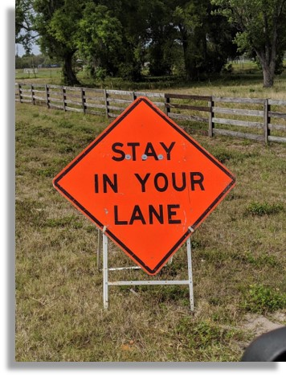
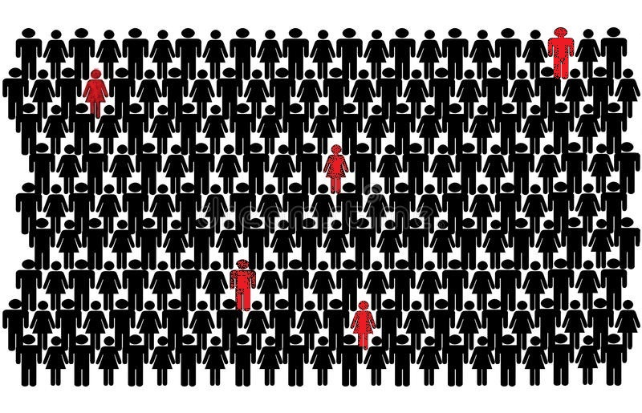
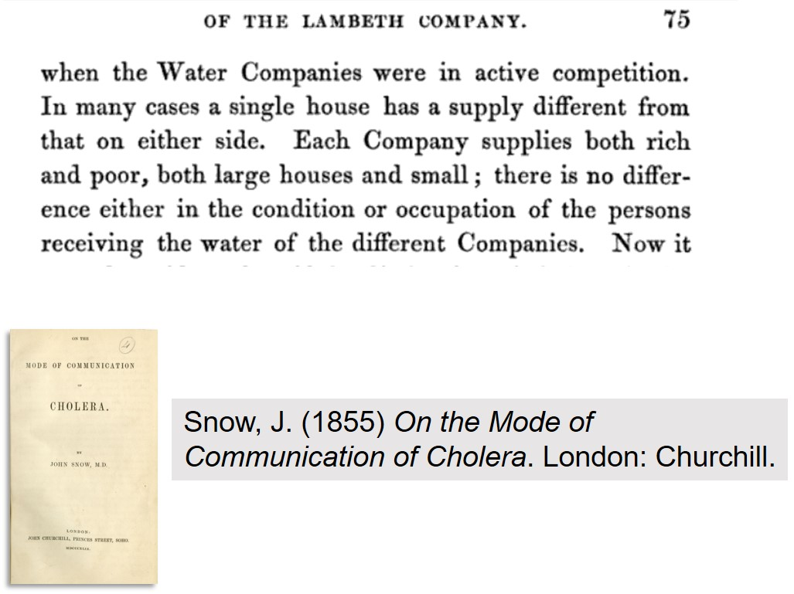

```{css, echo=F}
.inverse {
  background-color : #2293bf;
}
```

```{R, setup, include = F}
library(pacman)

p_load(here, MASS, tidyverse, ggplot2, xaringan, knitr, kableExtra, broom, xaringanthemer, gganimate, ggthemes, lme4, haven)


i_am("slides/EDLD_650_1_intro.rmd")


# Define color
extra_css <- list(
  ".red"   = list(color = "red"),
  ".blue"  =list(color = "blue"),
  ".green" = list(color = "#8bb174"),
  ".purple" = list(color = "#6A5ACD"),
  ".red-pink" = list(color= "#e64173"),
  ".grey-light" = list(color= "grey70"),
  ".slate" = list(color="#314f4f"),
  ".small" = list("font-size" = "90%"),
  ".large" = list("font-size" = "120%"))


write_extra_css(css = extra_css, outfile = "my_custom.css")


# Knitr options
opts_chunk$set(
  comment = "#>",
  fig.align = "center",
  fig.height = 6.75,
  fig.width = 10.5,
  warning = F,
  message = F
)
# opts_chunk$set(dev = "svg")
# 
# options(device = function(file, width, height) {
#   svg(tempfile(), width = width, height = height)
# })

options(knitr.table.format = "html")

hook_output <- knit_hooks$get("output")
knit_hooks$set(output = function(x, options) {
  lines <- options$output.lines
  if (is.null(lines)) {
    return(hook_output(x, options))  # pass to default hook
  }
  x <- unlist(strsplit(x, "\n"))
  more <- "..."
  if (length(lines)==1) {        # first n lines
    if (length(x) > lines) {
      # truncate the output, but add ....
      x <- c(head(x, lines), more)
    }
  } else {
    x <- c(more, x[lines], more)
  }
  # paste these lines together
  x <- paste(c(x, ""), collapse = "\n")
  hook_output(x, options)
})


```
# Why causal research? (I)

.pull-left[
```{r, echo=F, out.width="90%"}

```
]

--

.pull-right[
```{r, echo=F, out.width="120%"}

```
]

---
# Why causal research? (II)
- .large[**Abstract**]: We estimate the relationship between X and Y.
- .large[**Intro**]: It would be important to know whether X causes Y.
- .large[**Data and Analytic Strategy**]: Our data and research design are observational, and so we are unable to identify the causal impact of X on Y.
- .large[**Results**]: We find that a one-percentage point difference in X is associated with a 4.5 percentage point difference in Y.
- .large[**Discussion**]: A major limitation of our study is that we cannot rule out the possibility of confounders or reverse causality. Thus, while we cannot say whether X causes Y, our findings show this is a strong possibility and future research should explicitly explore it.
- .large[**Conclusion**]: But really `r emo::ji("wink")`, X causes Y.

---
# Why .red[*careful*] causal research?

.pull-left[
```{r, echo=F, out.width="90%"}

```
]

--

.pull-right[
```{r, echo=F, out.width="90%"}

```
]

--

```{r, echo=F, out.width="90%"}

```
---
# Descriptive and causal research

> **Quality causal research question**: Did the Success for All whole-school intervention improve students' reading achievement?

--

> **Quality descriptive research question**<sup>1</sup>: Do the teachers of English Learner students in self-contained classrooms have different pedagogical skill levels than teachers of non-English Learners?

.footnote[[1] Helpful resource: Loeb et al. (2017). [Descriptive analysis in education: A guide for researchers.](../readings/Loeb et al 2017.pdf) (NCEE 2017-4023). Washington, DC: US DoE, IES]

--

.pull-left[
.red[**Don't attempt to answer a question that is inherently (or implicitly) causal using a correlational approach!** .small[*We only care about the relationship between museum-going and mortality if it is a directionally causal one!*]]

]

.pull-right[
```{r, echo=F, out.width="30%"}

```
]

--

.large[**The overarching goal of this course**]: To provide you with (some of) the tools to be effective consumers and producers of causal research


---
# Roadmap

```{r, echo=F}
include_graphics("causal_id.jpg")
```


---
# Agenda
1. **Introduction**
  - Correlation $\neq$ causality
  - Roadmap
  - Agenda/goals
2. **A Causal Framework**
  - Experiments and potential outcomes
     - Class 1 Questions (Sections I and II)
  - Complexificating it
     - A word about DAGs
3. **Break**
4. **Nested data**
  - Class 1 Questions (Section III)
5. **Difference-in-differences**
6. **Conclusions**
  - Key course expectations & logistics
  - To-dos
  - Plus/deltas


---
# Goals for today

1. Articulate in words and simple graphical representations challenges in identifying causal relationships in quantitative data


2. Articulate in words and using simple mathematical terms a framework for identifying causal relationships in quantitative data
3. Describe (conceptually) unit fixed effects and their strengths (and limitations) in research designs seeking to identify causal relationships

4. Describe the conceptual approach to identifying causal effects using the difference-in-differences framework


---
class: middle, inverse

# Causal frameworks


---
# Five conditions of causal claims

[William Shadish, Donald Cook and Thomas Cambpell (2002)](https://books.google.com/books/about/Experimental_and_Quasi_experimental_Desi.html?id=o7jaAAAAMAAJ) adapt John Stuart Mill's critical conditions that must exist in order to defend the claim that one thing causes another:

.pull-left[

1. Cause must precede effect in time

2. Identified mechanism

3. Consistency

4. Responsiveness

5. No plausible alternative explanation

]


.pull-right[
```{r, echo=F, out.width="80%"}

```
]


---
class: middle, inverse

# Experiments and potential outcomes

---
# Sliding doors

.pull-left[

* What if you missed your train (or didn't)?

* What if you had never been born?

* What if the Beatles never existed?

* What if the Nazis won WWII?

]

.pull-right[
```{r, echo=F}

```
]

---
# An "ideal" experiment

Hypothetically, we could draw a random sample from a defined population:
.pull-left[
```{r, echo=F, out.width="60%"}

```
]

.pull-right[

- We could .blue[**implement the treatment**] for each participant
- And also concurrently .blue[**NOT implement the treatment**]
  - .small[We would need to be able to turn back time, and erase the impact and memory of the treatment in each case]

]

--

While this is obviously impossible, we can imagine that each participant has a value of the outcome that could .blue[**potentially**] be revealed under the following experimental conditions:

$Y_{i}^{1}$ = potential value of outcome for $i^{th}$ person, when treated $(D_{i} = 1)$

$Y_{i}^{0}$ = potential value of outcome for $i^{th}$ person, when .blue[**NOT**] treated $(D_{i} = 0)$


---
# An "ideal" experiment


$Y_{i}^{1}$ = potential value of outcome for $i^{th}$ person, when treated $(D_{i} = 1)$

$Y_{i}^{0}$ = potential value of outcome for $i^{th}$ person, when .blue[**NOT**] treated $(D_{i} = 0)$


The .blue[**Individual Treatment Effect (ITE)**] is the difference in potential outcome values between treatment and control conditions, for each individual:

$$ITE_{i} = Y_{i}^{1} - Y_{i}^{0}$$

--

.red[**We never actually observe this!!!**]

--


The .blue[**Average Treatment Effect (ATE)**] is the average of the individual treatment effects across all participants:

$$\hat{ATE}_{i} = \frac{1}{n}{\sum_{i}^n ITE_{i}}$$

--

If the ATE differed from zero, we could claim that the treatment *caused* the effect because there would be no other explanation for the differences detected between the treatment and control conditions!

---
# RCTs: the next best thing?

An "ideal" experiment such as this one is impossible because the same group of people cannot concurrently receive and not receive treatment. .red[**We have a missing data problem**]. We cannot actually estimate .blue[individual treatment effects] in practice, but if we are willing to make a few reasonable assumptions, we can still estimate the the .blue[average treatment effect]. This is particularly true when we conduct a .blue[randomized control trial (RCT)].

--

.pull-left[
```{r, echo=F, out.width="60%"}

```
]

.pull-right[
We can draw our random sample, and randomly assign each participant to the .blue[**Treatment**] (where we measure their value of $Y_{i}^{1}$ ) or .red[**Control**] (where we measure their value of $Y_{i}^{0}$ ) condition. 

]

--

$$\hat{ATE}_{i} = \frac{1}{n_{1}}{\sum_{i}^{n_1} ITE_{i}} - \frac{1}{n_{0}}{\sum_{i}^{n_0} ITE_{i}}$$
---
# The importance of exogeneity

The big idea in a randomized experiment is that treatment variation is .blue[**exogenously and randomly assigned**]. An external (or "exogenous") agent, usually the researcher, determines who is treated $(D_{i} = 1)$ and who is not $(D_{i} = 0)$.

.pull-left[

- .small[Values of all observed and unobserved characteristics of the participants are randomized across treatment and control groups.]
- .small[Members of the treatment and control groups are then equivalent, on average, in the population (.blue[“equal in expectation”]) before the experiment begins, on every possible dimension.]
- .small[The values of treatment variable, D, will also be completely uncorrelated with all characteristics of participants, observed and unobserved, in the population.]

]

.pull-right[
```{r, echo=F, out.width="70%"}

```

- Exogenous and random treatment variation validates the causal attribution of an experiment. This is referred to as the research design's .blue[**internal validity**].

]

---
# A simple *t*-test

The great thing about experiments is the cleaner the design, the simpler the analysis:

Population average treatment effect: $\mu_{1} - \mu_{0}$

Estimated by the sample mean difference: $\bar{Y_{1}} - \bar{Y_{0}}$

To test for a treatment effect, conduct a two-sample *t*-test:

$$t_{obs} = \frac{(\bar{Y_{1}} - \bar{Y_{0}})}{\sqrt{\frac{s^2}{n_1}+\frac{s^2}{n_0}}}$$ 

$$s^2 = \frac{(n_1 - 1)s_{1}^2 + (n_{0} - 1)s_{0}^2}{n_1 + n_2 -2}$$
$t_{crit} = t_{df = n_1 + n_2 -2}^{(\alpha = 0.05)}$ ; if $t_{obs} > t_{crit}$, then reject $H_0$!!!

--

No need for a pre-test, no need for controls, no need for complex statistical models!

---
# But OLS works too

In an experiment, a critical assumption of the generalized linear model (the foundation for OLS) is automatically satisfied:

$$Y_{i} = \beta_{0} + \beta_{1}D_{i} + \varepsilon_{i}$$
In a randomized experiment, the residuals are uncorrelated with the values of the treatment variable $(D_{i})$ because the values of the treatment variable are assigned at random, rendering them uncorrelated with everything, including the residuals.

--

.pull-left[*Reminder of key OLS assumption*: residuals must be .blue[**"independent and identically distributed" (i.i.d.)**]. By independent we mean residuals must be uncorrelated with everything else, including the predictor(s) in the model, otherwise our estimates of the regression parameters will be .red[**biased**].]

.pull-right[
```{r, echo=F, out.width="90%"}

```
]

---
# But OLS works BETTER!

Even in the most basic of well-executed RCTs, researchers will add covariates. 

--

.pull-left[
```{r, echo=F, out.width="120%"}

```
]

.pull-right[

$$Y_{i} = \beta_{0} + \beta_{1}D_{i} + \color{red}{\varepsilon_{i}}$$

.small[Once you add X, part of Y that is now predicted by X (but wasn't predicted by D by design), is no no longer part of residual]

$$Y_{i} = \beta_{0} + \beta_{1}D_{i} + \beta_{2}X_{i} + \color{purple}\varepsilon_{i}^{\prime}$$

.small[Reduced residual variance means smaller standard errors, larger *t*-statistics and **MAWWR POWER**!!!]
]

---
# Cold-calling

.pull-left[
#### .purple[Purpose]
- Formative assessment
- Equitable distribution of class participation
- Shared accountability for deep understanding of complex and technical readings

#### .purple[Norms]
- Questions posted by Thursday PM
- Preparation is expected
- These are hard concepts; mistakes are expected
- Judgments on accuracy of responses are about the responses, not the individual
- Questions and response are about learning, not performance
]

.pull-right[
#### .purple[Structure]
- All cold calls will be telegraphed
- Questions will come directly from question list
- Random draw (w/ replacement) from class list
- Ample wait time; multiple "at-bats"
- Teaching staff will identify incomplete or incorrect response and seek clarification
- Extension questions on a volunteer basis
]


---
class: middle, inverse

# Class 1 Discussion Questions
## Sections I and II


---
class: middle, inverse

# More complexity

---
# Threats to experimental validity

### 1. Contamination of treatment-control contrast
 - violations of Stable Unit Treatment-Value Assumption (SUTVA)
 - an important assumption: selection of others into an intervention should not affect your outcome
 
### 2. Cross overs (aka non-compliance)

### 3. Attrition

### 4. Participation in experiment affects behavior
 - Hawthorne and John Henry effects
 
> There is much to explore in these threats to validity. We will address some in the Instrumental Variables unit, but could form entire courses.

---
# Keep it real

Of course, in the real world, there are many reasons researchers are unable to conduct experiments:
.pull-left[
- Cost
- Time
- Willing partners
- Ethics
- Representativeness
- Power
- ...
]

.pull-right[
```{r, echo=F, out.width="90%"}

```
]

--

Thus, in this course, we will primarily concern ourselves with the goal of .blue[**recovering credibly causal estimates of treatment effects in observational data**]. 

--

but this is **hard**.

---
# Correlation $\neq$ causation pt. 562

RQ: What is the relationship between Oregon's annual per capita divorce rate and the U.S. per capita annual beef consumption? 

--
```{r, echo = F, fig.height = 4, fig.width= 8}
beef <- read_csv(here::here("data/divorce_beef.csv"))

db <- ggplot(beef, aes(divorce_rate, beef_consumption, label=year)) +
  geom_point() +
  geom_smooth(method = "lm", se = F) +
  theme_minimal() +
  ggtitle("Oregon Divorce Rate and U.S. Beef Consumption (2000-2009)")

lm_eqn <- function(beef){
    m <- lm(divorce_rate ~ beef_consumption, beef);
    eq <- substitute(italic(y) == a + b %.% italic(x)*","~~italic(r)^2~"="~r2, 
         list(a = format(unname(coef(m)[1]), digits = 2),
              b = format(unname(coef(m)[2]), digits = 2),
             r2 = format(summary(m)$r.squared, digits = 3)))
    as.character(as.expression(eq));
}

db + geom_text(x = 4.5, y = 62, label = lm_eqn(beef), parse=TRUE)
```

*On the 10 o'clock news tonight: does U.S. beef consumption cause more "beefs" between Oregonians and their spouses?*

---
# Divorce and Beef

Do increases in beef consumption in Oregon **cause** increases in the U.S. divorce rate?

--

```{r, echo = F, fig.height = 4, fig.width= 8}
db + geom_text(x = 4.5, y = 62, label = lm_eqn(beef), parse=TRUE) +
  geom_text()
```

--

This is a classic problem of a .blue[**confounder**]!<sup>1</sup>


.footnote[[1] More fun with [spurious correlations](https://www.tylervigen.com/spurious-correlations)]

---
# Why correlation $\neq$ causation?

Common barriers in attributing causality to observed co-relationships include:
- .purple[Confounders]: a third variable causes changes in X and also in Y
- [Colliders](http://www.the100.ci/2017/03/14/that-one-weird-third-variable-problem-nobody-ever-mentions-conditioning-on-a-collider/): a third variable that is caused by both the predictor and outcome; controlling for this can make a true causal relationship disappear!
- .purple[Reverse causation]: X may cause Y **or** Y may cause X
- .purple[Simpson's Paradox]: a third variable may reverse the correlation
- Also, **lack** of correlation $\neq$ **lack** of causality

```{r, echo=F, out.width="40%"}
include_graphics("causalinf.jpg")
```
h/t [@causalinf](https://twitter.com/causalinf)

---
# Directed acyclic graphs (DAGs)

[Directed Acyclical Graphs (DAGs)](https://journals.sagepub.com/doi/pdf/10.1177/2515245917745629) model causal relationships through graphical representation.


```{r, echo=F, fig.height=5}
dag <- ggdag::dagify(y ~ x,
                     exposure = "x",
                     outcome = "y",
              labels = c("x" = "Beef",
                         "y" = "Divorce"),
              coords = list(x = c(x=1, y=3),
                            y = c(x=2, y=2))
                            )
ggdag::ggdag(dag, use_labels = "label", text=F, text_size = 8) +
  ggdag::theme_dag() + 
   guides(fill = F, color=F)
```

---
# Spurious correlation

```{r, echo=F, fig.height=3.5}
dag2 <- ggdag::dagify(y ~ x + z,
                       x ~ z,
                     exposure = "x",
                     outcome = "y",
                     labels = c("x" = "Beef",
                         "y" = "Divorce",
                         "z" = "Year"),
                coords = list(x = c(x = 1, z = 2, y = 3),
                              y = c(x = 2, z = 3, y = 2))
                              )
ggdag::ggdag_status(dag2, use_labels = "label", text=F, text_size=8) +
  ggdag::theme_dag() + 
  guides(fill = F, color=F)
```

--

> .small[*It is easy to prove that the wearing of tall hats and the carrying of umbrellas enlarges the chest, prolongs life, and confers comparative immunity from disease...A university degree, a daily bath, the owning of thirty pairs of trousers, a knowledge of Wagner’s music, a pew in church, anything, in short, that implies more means and better nurture…can be statistically palmed off as a magic spell conferring all sorts of privileges...The mathematician whose correlations would fill a Newton with admiration, may, in collecting and accepting data and drawing conclusions from them, fall into quite crude errors by just such popular oversights.* -George Bernard Shaw (1906)]

---
# A DAG-gone example

```{r, echo=F, fig.height=3.5}
dag0 <- ggdag::dagify(y ~ d ,
                     exposure = "d",
                     outcome = "y",
                     labels = c("d" = "College",
                         "y" = "Earnings"),
                coords = list(x = c(d = 1, y = 3),
                              y = c(d = 2, y = 2))
                              )
ggdag::ggdag_status(dag0, use_labels = "label", text=F, text_size = 8) +
    guides(fill = F, color=F) +
    ggdag::theme_dag() 
```

- Directed Acyclical Graphs (DAGs)] model causal relationships through graphical representation
- Arrows represent directional causal effects; missing arrow implies lack of a causal path
- Effects are either:
   - direct $(D \rightarrow Y)$; i.e., the causal effect of D (college) on Y (earnings); **or**
   
---
# A DAG-gone example

```{r, echo=F, fig.height=3.5}
dag3 <- ggdag::dagify(y ~ d + x,
                       d ~ x,
                     exposure = "d",
                     outcome = "y",
                     labels = c("d" = "College",
                         "y" = "Earnings",
                         "x" = "Family"),
                coords = list(x = c(d = 1, x = 2, y = 3),
                              y = c(d = 2, x = 3, y = 2))
                              )
ggdag::ggdag_status(dag3, use_labels = "label", text=F, text_size = 8) +
    guides(fill = F, color=F) +
    ggdag::theme_dag() 
```

- Directed Acyclical Graphs (DAGs)] model causal relationships through graphical representation
- Arrows represent directional causal effects; missing arrow implies lack of a causal path
- Effects are either:
   - direct $(D \rightarrow Y)$; i.e., the causal effect of D (college) on Y (earnings); or
   - indirect $(D \leftarrow X \rightarrow Y)$; i.e., a backdoor path created by a confounder
- Here, conditioning on X (observed family characteristics) closes the backdoor and allows a causal estimate

---
# Confounders

```{r, echo=F, fig.height=3.5}
dag4 <- ggdag::dagify(y ~ d + i,
                      i ~ pe,
                      pe  ~ i + x,
                       d ~ x + pe + i,
                     exposure = "d",
                     outcome = "y",
                     labels = c("d" = "College",
                         "y" = "Earnings",
                         "x" = "Unobs. Family",
                         "pe" = "Parent Ed",
                         "i" = "Family income"),
                coords = list(x = c(d = 2, x = 1, pe = 1, i = 2, y = 3),
                              y = c(d = 2, x = 3, pe = 1, i = 1, y = 2))
                              )
ggdag::ggdag_status(dag4, use_labels = "label", text=F, text_size = 6) +
    guides(fill = F, color=F) +
    ggdag::theme_dag() 
```

We often hope that conditioning on the confounder closes **all** backdoor paths and thus allows us to estimate the direct effect of D on Y:
- $D \rightarrow Y$: causal effect of D on Y
- $D \leftarrow I \rightarrow Y$: income influences both college and earnings
- $D \leftarrow PE \rightarrow I \rightarrow Y$: parental education influences family income which influences own earnings
- $D \leftarrow X \rightarrow PE \rightarrow I \rightarrow Y$: .small[unobserved background characteristics influence parental education, family income, college attendance and own earnings]

---
# Confounders

```{r, echo=F, fig.height=3.5}
dag5 <- ggdag::dagify(y ~ d + i + x,
                      i ~ pe,
                      pe  ~ i + x,
                       d ~ x + pe + i,
                     exposure = "d",
                     outcome = "y",
                     labels = c("d" = "College",
                         "y" = "Earnings",
                         "x" = "Unobs. Family",
                         "pe" = "Parent Ed",
                         "i" = "Family income"),
                coords = list(x = c(d = 2, x = 1, pe = 1, i = 2, y = 3),
                              y = c(d = 2, x = 3, pe = 1, i = 1, y = 2))
                              )
ggdag::ggdag_status(dag5, use_labels = "label", text=F, text_size = 6) +
    guides(fill = F, color=F) +
    ggdag::theme_dag() 
```

We often hope that conditioning on the confounder closes **all** backdoor paths and thus allows us to estimate the direct effect of D on Y:
- $D \rightarrow Y$: causal effect of D on Y
- $D \leftarrow I \rightarrow Y$: income influences both college and earnings
- $D \leftarrow PE \rightarrow I \rightarrow Y$: parental education influences family income which influences own earnings
- $D \leftarrow X \rightarrow PE \rightarrow I \rightarrow Y$: .small[unobserved background characteristics influence parental education, family income, college attendance and own earnings]
- .red[**BUT**] is it true that family background has no direct effect on earnings?

---
# Colliders

```{r, echo=F, fig.height=3.5}
dag6 <- ggdag::dagify(y ~ d ,
                       x ~ d + y,
                     exposure = "d",
                     outcome = "y",
                     labels = c("d" = "College",
                         "y" = "Earnings",
                         "x" = "Career choice"),
                coords = list(x = c(d = 1, x = 2, y = 3),
                              y = c(d = 2, x = 1, y = 2))
                              )
ggdag::ggdag_status(dag6, use_labels = "label", text=F, text_size = 8) +
    guides(fill = F, color=F) +
    ggdag::theme_dag() 
```

- Career choice is a .blue[collider]. 
- No need to condition on it as the backdoor path is already closed
- .red[Leave colliders alone!] Beware of conditioning on them and thereby opening backdoors or (worse) introducing bias.
  - Here, doing so might underestimate the effect of going to college

---
# Where DAGs get tricky (for me)

```{r, echo=F, fig.height=3.5}
college_dag <- ggdag::dagify(
  earnings ~ college + parentearn + testscore  + discrimination + labormarket + marriage,
  college ~ parentearn + testscore + discrimination + affordability + highschool,
  highschool ~ parentearn + discrimination,
  testscore ~ parentearn,
  marriage ~ college + labormarket,
  labormarket ~ college,
  affordability ~ parentearn,
  exposure = "college",
  outcome = "earnings",
  labels = c(earnings = "Adult earnings", college = "College Attendance", parentearn = "Parental earnings",
             testscore = "HS test scores", discrimination = "Societal discrimination", 
             labormarket = "Labor market conditions", affordability = "College price",
             highschool = "High-school quality", marriage = "Married by 30")
)

ggdag::ggdag_status(college_dag, use_labels = "label", layout="nicely", text = FALSE) + 
  guides(fill = FALSE, color = FALSE) +  
  ggdag::theme_dag()
```

--

.small[DAGs can be an intuitive and careful way of thinking through causal research design (see [Pearl, 2009](http://bayes.cs.ucla.edu/BOOK-2K/)). They also risk encouraging the researcher to believe she can solve by analysis what is broke by design (see [Imbens, 2020](https://arxiv.org/abs/1907.07271)).

In this class, we'll use the .blue[**potential outcomes framework**] and rely on research designs in which we can credibly argue that .blue[**assignment to treatment is exogenous or based on observable characteristics**], but concepts such as confounders, colliders and controlling backdoors are valuable parts of your toolkits. You can learn much more about DAGs than I have presented here in our SEM sequence (EDLD 633/634)!]


---
class: middle, inverse

# Break

---
class: middle, inverse

# Nested Data

---

# What is nested data?
Recall the Success for All evaluation from *Methods Matter*<sup>1</sup>
```{r, echo=T}
ch7_sfa <- read_dta(here("data/ch7_sfa.dta"))
```

```{r, echo=F, output.lines = -(0:1)}
ch7_sfa$sfa <- as_factor(ch7_sfa$sfa)
ch7_sfa$schid <- as_factor(ch7_sfa$schid)

head(ch7_sfa, n=3)
tail(ch7_sfa, n=3)
```

.footnote[[1] Most datasets from *MM* available from [UCLA stats site](https://stats.idre.ucla.edu/other/examples/methods-matter/).]

---
# Modeling nested data

### Physical nesting
- Our data can be nested in multiple units: students inside classrooms, classrooms inside schools, schools inside districts, districts inside states, etc.

### Conceptual nesting
- If we observe students across multiple years, we will have multiple observations nested inside students
- If we administer assessments multiple times, we will have tests nested inside students

.blue[Each of these forms of nesting have implications for how we model treatment effects (and on our standard errors).] 

In the SfA example, we want to capture the effect of receiving the SfA treatment, .blue[**independent of the effect of the unobserved and observed qualities of the school the student attends**].


---
# Two common approaches

### Random intercepts (aka random effects)

$$WATTACK_{ij} = \gamma_{0} + \gamma_{1}SFA_{j} + (\varepsilon_{ij} + \nu_{j})$$

You may also have seen this written as:

$$WATTACK_{ij} = \gamma_{00} + \gamma_{01}SFA_{j} + (\varepsilon_{ij} + \nu_{0j})$$
.red[**THESE ARE IDENTICAL!**]


---
# Two common approaches

### Random intercepts (aka random effects)

$$WATTACK_{ij} = \gamma_{0} + \gamma_{1}SFA_{j} + (\varepsilon_{ij} + \nu_{j})$$

You may also have seen this written as:

$$WATTACK_{ij} = \gamma_{00} + \gamma_{01}SFA_{j} + (\varepsilon_{ij} + \nu_{0j})$$

### Fixed intercepts (aka fixed effects)

$$WATTACK_{ij} = \sum_{1}^{J}\alpha_{j}S_{ij} + \gamma_{1}SFA_\color{red}{ij} + \varepsilon_{ij}$$
.red[Notice the within-school variation in treatment in this hypothetical example]

> A note on notation: fixed effects are often represented with capital Greek letters $(e.g., \Gamma_j, \Pi_t, \Delta_k)$. Vectors of covariates are often represented with vector notation $(e.g., \textbf{X}_{ij})$

---
# What is a fixed effect doing?

```{r, echo=F, fig.height=4}
df <- data.frame(Person = rep(1:4,50)) %>%
  mutate(X = .5+.5*(Person-2.5) + rnorm(200)) %>%
  mutate(Y = -.5*X + (Person-2.5) + 1 + rnorm(200),time="1") %>%
  group_by(Person) %>%
  mutate(mean_X=mean(X),mean_Y=mean(Y)) %>%
  ungroup()

#Calculate correlations
before_cor <- paste("1. Start with raw data. Correlation between X and Y: ",round(cor(df$X,df$Y),3),sep='')
after_cor <- paste("6. Analyze what's left! Within-school Correlation Between X and Y: ",round(cor(df$X-df$mean_X,df$Y-df$mean_Y),3),sep='')

#Add step 2 in which X is demeaned, and 3 in which both X and Y are, and 4 which just changes label
dffull <- rbind(
  #Step 1: Raw data only
  df %>% mutate(mean_X=NA,mean_Y=NA,time=before_cor),
  #Step 2: Add x-lines
  df %>% mutate(mean_Y=NA,time='2. Figure out any between-school differences in X'),
  #Step 3: X de-meaned 
  df %>% mutate(X = X - mean_X,mean_X=0,mean_Y=NA,time="3. Remove all between-school differences in X"),
  #Step 4: Remove X lines, add Y
  df %>% mutate(X = X - mean_X,mean_X=NA,time="4. Figure out any between-school differences in Y"),
  #Step 5: Y de-meaned
  df %>% mutate(X = X - mean_X,Y = Y - mean_Y,mean_X=NA,mean_Y=0,time="5. Remove all between-school differences in Y"),
  #Step 6: Raw demeaned data only
  df %>% mutate(X = X - mean_X,Y = Y - mean_Y,mean_X=NA,mean_Y=NA,time=after_cor))

p <- ggplot(dffull,aes(y=Y,x=X,color=as.factor(Person)))+geom_point()+
  geom_vline(aes(xintercept=mean_X,color=as.factor(Person)))+
  geom_hline(aes(yintercept=mean_Y,color=as.factor(Person)))+
  guides(color=guide_legend(title="School"))+
  scale_color_colorblind()+
  theme_minimal() +
  labs(title = 'The Relationship between Y and X, with School Fixed Effects \n{next_state}')+
  transition_states(time,transition_length=c(12,32,12,32,12,12),state_length=c(160,100,75,100,75,160),wrap=FALSE)+
  ease_aes('sine-in-out')+
  exit_fade()+enter_fade()

animate(p,nframes=200, renderer = gifski_renderer(loop = FALSE))
```

.small[h/t [@nickchk](https://twitter.com/nickchk)]

---
# Random v. Fixed Effects

.small[
|                     |                      Random effects       |                Fixed effects
|-----------------------------------------------------------------------------------------------------------
|  Strengths          |  - Minimal loss of power <br> - Preserves (almost all of) outcome variance                  | - Accounts for observed and unobserved, time-invariant, within-group differences <br> - Reduces outcome variance to only that relevant to estimating treatment effect
| Limitations         | - Introduces bias if any correlation between predictors and group-level residuals <br> - Less transparent (more complex) interpretation     | - Sacrifices degrees of freedom <br> - Cannot have hierarchically nested fixed effects <br> - Cannot have fixed effect collinear with level of treatment <br> - Cannot include adjustments ("controls") that are invariant within unit
]

---
# Random v. Fixed Effects

### Some guidelines:

- Preference should be informed by data structure, analytic strategy and context<sup>1</sup>

- In both cases, need to pay attention to how you calculate standard errors

- Often disciplinary preferences

- Generally, with long panels (many w/in grouping unit observations) and in non-experimental settings where we seek to estimate treatment effects, fixed effects are preferable

.footnote[[1] .small[See Clark & Linzer [(PSRM, 2015)](../readings/Clark Linzer 2015.pdf) for a short, minimally technical, summary. *Note*: mixed models with both fixed- and random-intercepts are possible as well as are many other multi-level models (random slopes, random slopes and intercepts, etc.). Consider taking our multi-level modeling sequence (EDLD 628/629) to learn more.]]


---
# Random intercepts application
```{r, echo=T, output.lines = -(1:10)}
sfa <- lme4::lmer(wattack ~ sfa + (1 | schid), data=ch7_sfa)
summary(sfa)
```

---
# Random intercepts application
```{r, echo=F, output.lines = -(1:10), highlight.output=c(4:5, 10:11)}
sfa <- lme4::lmer(wattack ~ sfa + (1 | schid), data=ch7_sfa)
summary(sfa)
```

Compare the intra-class correlation (ICC) $(\hat{\rho})$ w/ Table 7.1 in *MM* (p. 114):

$$\hat{\rho} = \frac{75.69}{75.69 + 314.23} = 0.194$$
---
class: middle, inverse

# Class 1 Discussion Questions
## Section III

1. Review your answers to Section III
2. Revise any of your answers based on the information from the past slides
3. What is still unclear? Turn-and-talk with neighbor to see if you can gain clarity
4. We will share out any outstanding questions for the group to answer

---
# Roadmap
```{r, echo=F, out.width="110%"}
include_graphics("causal_id.jpg")
```
---
class: middle, inverse

# Difference-in-differences (DD)

---
# S. London cholera outbreak 1854

.pull-left[
- Londed was a crowded, dirty city w/ waste disposed directly in Thames River
- Disease poorly understood; cholera widely believed to be caused by miasma & contagion
- Outbreak in S. London in summer of 1854 killing over 5,000
  - Followed an earlier outbreak in 1849 that had killed >6,000
- Physician John Snow had developed a theory that these illnesses were water-borne and set out to prove it
]

.pull-right[
```{r, echo=F}

```
]
---
# The "Grand Experiment" (I)

.pull-left[
- Water is supplied to households be competing private companies:
  1. Southwark & Vauxhall
  2. Lambeth
- Southwark & Vauxhall water from Thames
- Lambeth from Thames until 1852, then from Ditton (22 miles upstream)
- Some portions of the city receive water from only one of companies; others from both
]

.pull-right[
```{r, echo=F}

```
]

---
# The "Grand Experiment" (II)

.pull-left[
- When companies supply to same area, distributed quasi-randomly
- Snow tallies the deaths in all districts supplied by one, the other, or both companies as well as the deaths in the 1849 outbreak
]

.pull-right[
```{r, echo=F}

```
]

.blue[**We will now pause this history lesson for a short methodological break**]

---
# So many differences!!!

What is one approach by which we might estimate the effects of a policy change or intervention?

|                     |        Treatment group         
|------------------------------------------------------
| Before              |   $Y_{0}$                       
| After               |   $Y_{1}$                       

--

Could just subtract the mean value of "before" levels of the outcome from mean value of "after":

$\Delta Y = \bar{Y_{1}} - \bar{Y_{0}}$

.red[BUT], there could be lots of other things going on in between those two times!

---
# The "difference" in DD


What is one approach by which we might estimate the effects of a policy change or intervention?

|                     |        Treatment group               |        "Control" group
|-------------------------------------------------------------------------------------------------
| Before              |   $Y_{0}^{D=1}$                      |      $Y_{0}^{D=0}$
| After               |   $Y_{1}^{D=1}$                      |      $Y_{1}^{D=0}$

--

Difference-in-difference (DD) estimates are the difference of two differences:

$\hat{ATE} = \color{blue}{(Y_{1}^{D=1} - Y_{0}^{D=1})} - \color{purple}{(Y_{1}^{D=0} - Y_{0}^{D=0})}$

---
# Graphical DD

```{r, echo=F, fig.height=5}
data <- tibble(
  Y = c(2, 6, 1, 2, 2, 3),
  Unit = c("Treat", "Treat", "Control", "Control", "Counterfac T", "Counterfac T"),
  T = c(0, 1, 0, 1, 0, 1)
)

data$T <- ordered(data$T,
                  levels = c(0, 1),
                  labels = c("Before", "After"))
# plot
data %>% 
  ggplot(aes(x = T, y = Y, group = Unit, color=Unit, linetype=Unit)) + geom_line(size = 1.5) + 
  scale_color_manual(values=c("red", "blue", "blue")) + 
  scale_linetype_manual(values=c("solid", "dashed", "solid")) +
  ggbrace::geom_brace(aes(x=c(2.1, 2.2), y=c(3,6), label="Treatment effect"), rotate=90, inherit.data=FALSE, labelsize=5) +
  annotate("text", x=1.6, y=5.8, label="Observed change - Treatment", color="blue") +
  annotate("text", x=2.3, y=2, label="Observed change - 'Control'", color="red") +
  annotate("text", x=2.2, y=2.8, label="Hypothetical change - T IF not treated", color="blue") +
  labs(x = "", y = "Outcome") + 
  theme_minimal() +
  theme(axis.title = element_text(size = 18),
        axis.text = element_text(size = 16),
        legend.position = 'none')
```

---
# John Snow's DD

**Table XII**. Deaths per 10,000 in homes served by Lambeth and Southwark & Vauxhall, 1849 and 1854

|                     |  Treatment = Lambeth    |  Control = S&V      | Diff-in-Diff
|-------------------------------------------------------------------------------------------------
| Before = 1849       |  85                     |   135               | 
| After = 1854        |  19                     |   147               |
| Difference          | -66                     |   12                | .blue[**-78**]

--

.pull-left[
```{r, echo=F, out.height="60%"}

```
]

.pull-right[
.small[Clients of Southwark & Vauxhall experienced more deaths per 10,000 in the 1854 cholera outbreak than in the 1849 one. The Lambeth clients, therefore, might have expected to have more also, but they had MANY fewer. The only thing that changed was the source of the Lambeth water. From this evidence, Snow claimed that **the only possible cause was the water!**]
]

---
## DD by regression

We can get the same results for a two-period DD in a regression framework, which allows us to:
- Add statistical adjustments (see previous discussion on value in experiments)
- Model various functional forms, and more!

$Y_{it} = \beta_{0} + \beta_{1}TREAT_{it} + \beta_{2}AFTER_{it} + \color{purple}{\beta_{3}}TREAT \times AFTER_{it} + \varepsilon_{it}$

where, *TREAT* = 1 if in treatment and = 0 if in control and ...

*AFTER* = if after the treatment occurred (even if you didn't experience the treatment) and *AFTER* = 0 if before treatment; **OR**

$CHOLERA_{it} = \beta_{0} + \beta_{1}LAMBETH_{it} + \beta_{2}1854_{it} + \color{purple}{\beta_{3}}LAMBETH \times 1854_{it} + \varepsilon_{it}$

Here, $\color{purple}{\beta_{3}}$ is our causal parameter of interest. We can interpret it as the causal effect of living in a home that was served water from the Thames on the death rate of residents of those homes.
---
class: middle, inverse
# Synthesis and wrap-up

---
# Goals for today

1. Articulate in words and simple graphical representations challenges in identifying causal relationships in quantitative data

2. Articulate in words and using simple mathematical terms a framework for identifying causal relationships in quantitative data

3. Describe (conceptually) unit fixed effects and their strengths (and limitations) in research designs seeking to identify causal relationships

4. Describe the conceptual approach to identifying causal effects using the difference-in-differences framework

---
# Key logistics

- Review syllabus carefully

- Prepare questions in advance (partner work encouraged)

- Review session? (multi-level models? residuals/standard errors? notation?)

- Data Analysis and Replication Exercises (DAREs)
- Project proposal by January 28
  - Meet w/ teaching staff to discuss at least once
  - In class scholarly presentation (March 8)
  - Written final research project (March 17; *optional feedback by March 10*)
  
---
class: inverse
# To-dos

### Week 3: Difference-in-differences
### Readings for next week:
- Murnane & Willet, Chapter 8
- Dynarski (2003), Does aid matter?
- Further, MHE: Ch. 5; 'Metrics: Ch. 5, Mixtape: Chs. 8 & 9

### Assignments Due
- Complete student survey on Canvas (if not yet done) (Jan. 5)
- DARE #1 due: 9:00am January 17


---
# Feedback

## Plus/Deltas

- On front of index card
- What worked about today's class?
- What could be improved or changed about the pedagogical process of today's class?

## Clear/Murky

- On back of index card
- What substantively is most clear to you or got clarified during class today?
- What is the muddiest substantive topic for you?

- .blue[*For today only, could you please indicate (a) are you interested in attending a review session?; (b) if so, what topics would you like to see included in the review?; (c) what times are you available in the next two weeks?*]

