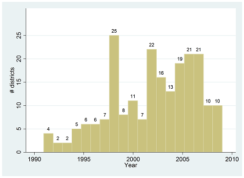

```{css, echo=F}
.inverse {
  background-color : #2293bf;
}
```

```{R, setup, include = F}
library(pacman)

p_load(here, tidyverse, DT, ggplot2, xaringan, knitr, kableExtra, modelsummary, stargazer, xaringanthemer, gganimate, ggthemes, fixest, haven)


i_am("slides/EDLD_650_2_DD_1.rmd")


# Define color
extra_css <- list(
  ".red"   = list(color = "red"),
  ".blue"  =list(color = "blue"),
  ".green" = list(color = "#8bb174"),
  ".purple" = list(color = "#6A5ACD"),
  ".red-pink" = list(color= "#e64173"),
  ".grey-light" = list(color= "grey70"),
  ".slate" = list(color="#314f4f"),
  ".small" = list("font-size" = "90%"),
  ".large" = list("font-size" = "120%"))


write_extra_css(css = extra_css, outfile = "my_custom.css")


# Knitr options
opts_chunk$set(
  comment = "#>",
  fig.align = "center",
  fig.height = 6.75,
  fig.width = 10.5,
  warning = F,
  message = F
)
# opts_chunk$set(dev = "svg")
# 
# options(device = function(file, width, height) {
#   svg(tempfile(), width = width, height = height)
# })

options(knitr.table.format = "html")

hook_output <- knit_hooks$get("output")
knit_hooks$set(output = function(x, options) {
  lines <- options$output.lines
  if (is.null(lines)) {
    return(hook_output(x, options))  # pass to default hook
  }
  x <- unlist(strsplit(x, "\n"))
  more <- "..."
  if (length(lines)==1) {        # first n lines
    if (length(x) > lines) {
      # truncate the output, but add ....
      x <- c(head(x, lines), more)
    }
  } else {
    x <- c(more, x[lines], more)
  }
  # paste these lines together
  x <- paste(c(x, ""), collapse = "\n")
  hook_output(x, options)
})


```

# Agenda

### 1. Roadmap and Goals
### 2. Estimating DD effects in data
### 3. Wrap-up
- DARE #1

---
# Roadmap

```{r, echo=F}
  include_graphics("causal_id.jpg")
```
---
# Goals

.large[
1. Describe threats to validity in difference-in-differences (DD) identification strategy and multiple approaches to address these threats
   + *from responding to Discussion Questions*
2. Using a cleaned dataset, estimate multiple DD specifications in R and interpret these results
   + *from this lecture and accompanying [script](./code/EDLD_650_2_DD_script.R)*
]

---
# Programming in EDLD 650

## What you won't get `r emo::ji("frown")`
- A heavy dose of data management and visualization strategies
- The most efficient code with extensive use of functions

--

## What you will get `r emo::ji("smile")`
- A review of the programming steps you should take as part of the **actual** research process
- *Some* model code for data management and visualization
- Programming strategies and packages that can be used to estimate the causal inference techniques we will study
- A community of skilled programmers who will expand our collective knowledge base!

---
class: middle, inverse

# Estimating a classic, two-period difference-in-differences (DD) model

---
# Replicating Dynarski (2003)

Recall Dynarski's primary model (Eq. 2):

$$
\begin{align}
  y_i=\alpha + \beta(\text{FATHERDEC}_i \times \text{BEFORE}_i) + \delta \text{FATHERDEC}_i + \theta \text{BEFORE}_i + \upsilon_i
\end{align}
$$
--

<br>

.large[**Let's try to fit this in our data!**]

---
# Reading in the data

I'm using the `haven` package to import a data file that is in the Stata .dta format. Lotsa options for importing file formats other than .csv ( `foreign` and `rio` are two such ones)!
```{r, echo=TRUE}
dynarski <- haven::read_dta(here("data/ch8_dynarski.dta"))
  
head(dynarski)
```
---
# Viewing the data

```{r, echo=FALSE, eval = T}
datatable(dynarski[,c(1, 4:8)], fillContainer = FALSE, options = 
                list(pageLength = 7))
```


---
# Understanding the data (1)

```{r, echo=TRUE}
d <- select(dynarski, coll, hgc23, fatherdec, offer)

summary(d)
```
--
```{r, echo=TRUE}  
sum(is.na(coll))
 
```

---
# Understanding the data (2)

```{r, echo=FALSE}
dynarski$fac_coll <- as.factor(dynarski$coll)
  dynarski$fac_coll <- factor(dynarski$fac_coll, levels = c(0,1),labels=c("No College", "College"))
dynarski$fac_fatherdec <- as.factor(dynarski$fatherdec)
  dynarski$fac_fatherdec <- factor(dynarski$fac_fatherdec, levels=c(0,1), labels=c("Father not deceased", "Father deceased"))
```

```{r, echo=TRUE}
college <- table(dynarski$fac_fatherdec, dynarski$fac_coll)
college
```
---
# Plot outcome data

```{r, echo=TRUE, fig.height=4.75}
hg <- ggplot(dynarski, aes(hgc23)) + geom_histogram(binwidth=1) 
  hg + scale_x_continuous(name="Highest-grade completed at 23", 
                          breaks=c(10, 12, 14, 16, 18, 20)) +
      theme_pander(base_size=18)

```
---
# Summary statistics table

```{r, echo=F, results='asis'}

stargazer(as.data.frame(d), type="html", summary=T, summary.logical=T, summary.stat=(c("n", "mean", "sd")),
            covariate.labels = c("Attend college at 23", "Years schooling at 23", "Father deceased", "Offer"),
            notes="Notes: This table presents unweighted means and standard deviations from the NLSY poverty and random samples used in the                     Dynarski (2003) paper.",
            digits=2, notes.append = F, title="Table 1. Descriptive Statistics")
```


---
# Graphical DD

```{r, echo=F, fig.height=5}
dynarski <- mutate(dynarski, post = ifelse(offer==1,0,1))

dd <- ggplot(dynarski, aes(post,coll)) + aes(color=factor(fatherdec)) + 
      stat_summary(fun=mean, geom="line") + labs(y="Attend college (%)", 
      color="Father Deceased") + scale_x_discrete(name="Year", 
      breaks=c(0, 1), limits=c(0, 1), labels=c("0"= "pre-1981", "1"= "post-1981")) +
      expand_limits(y=c(0.35, 0.6), x=c(-0.25, 1)) +
      annotate("text", x = 1, y = 0.45, label = "NOT deceased father", color = "#F8766D", size = 6) +
      annotate("text", x = 1, y = 0.39, label = "DECEASED father", color = "#00BFC4", size = 6) +
      theme_pander(base_size = 20) +
      theme(legend.position = "none") 
dd
```

--

.blue[**What is treatment effect?**]

--

**What is the core .blue[identifying assumption] assumption underlying the DD framework?** How do we know whether we've satisfied it?

---
# Graphical DD
```{r, echo=F, fig.height=5}
dd +
  annotate("segment", x = -0.2, xend = 0, y = .54, yend = 0.511, color = "#00BFC4", linetype = "dashed") +
  annotate("segment", x = -0.2, xend = 0, y = .4778, yend = 0.47, color = "#F8766D", linetype = "dashed")
```

.blue[**What would you think if you "knew" this was the pattern?**]

---
## Estimate classic two-period DD
Dynarski's original model:
$$
\begin{align}
  y_i=\alpha + \beta(\text{FATHERDEC}_i \times \text{BEFORE}_i) + \delta \text{FATHERDEC}_i + \theta \text{BEFORE}_i + \upsilon_i
\end{align}
$$
--
Murnane and Willet have renamed the variable to make clear that a value of 1 means individuals are eligible for aid, so we'll do the same:
$$
\begin{align}
  y_i=\alpha + \beta(\text{FATHERDEC}_i \times \text{OFFER}_i) + \delta \text{FATHERDEC}_i + \theta \text{OFFER}_i + \upsilon_i
\end{align}
$$
---
## Estimate classic two-period DD

$$
\begin{align}
  y_i=\alpha + \beta(\text{FATHERDEC}_i \times \text{OFFER}_i) + \delta \text{FATHERDEC}_i + \theta \text{OFFER}_i + \upsilon_i
\end{align}
$$

```{r, echo=TRUE}
lm(coll ~ fatherdec*offer, data=dynarski)
```

--

This doesn't quiet match, let's add the weights in...

---
## Estimate classic two-period DD

$$
\begin{align}
  y_i=\alpha + \beta(\text{FATHERDEC}_i \times \text{OFFER}_i) + \delta \text{FATHERDEC}_i + \theta \text{OFFER}_i + \upsilon_i
\end{align}
$$
```{r, echo=TRUE}
lm(coll ~ fatherdec*offer, data=dynarski, 
            weights=dynarski$wt88)
```

--

Pretty underwhelming output?

---
# Under the hood
```{r, echo=TRUE}
est_dynarski <- lm(coll ~ fatherdec*offer, 
                   data=dynarski, weights=dynarski$wt88)
est_dynarski %>% names()
```

--

```{r, echo=TRUE}
est_dynarski %>% tidy()
```

---
# Further under the hood
```{r, echo=TRUE, output.lines= -(1:5), highlight.output=c(6, 8:10)}
summary(est_dynarski)
```

---
# Making a no-fuss table

.small[
```{r, results = 'asis', echo=TRUE}
stargazer(est_dynarski, type='html', single.row = T)
```
]

---
# Central DD asssumptions

In order to fully trust that the estimates produced by a DD analysis are unbiased by endogeneity, we need to make (and defend) the following two assumptions:

1. Not-treated (or not-yet-treated) units are .blue[**valid counterfactuals**]
  - Parallel trends?
  - Selection into treatment? (non-exogeneity)

--
2. There are no .blue[**simultaneous shocks**] or unobserved .blue[**secular trends**]
  - Other observed and unobserved events or patterns?

--

We'll look at how to address some of these in the next section of the lecture, and you'll read more about how to do so in the readings and DARE for next week!

---
class: middle, inverse

# DD in panel data

#### A. The two-way fixed effect (TWFE) estimator for staggered implementation
#### B. Appropriate statistical inference
#### C. Assessing the parallel trends assumption (PTA)
#### D. The modern event-study approach

---
# End of desegregation
.small[
- In 1991, 480 school districts were under court desegregation order
- In following two decades, nearly half (215) were released and returned to neighborhood assignment patterns
- Timing of release was arguably .blue[**exogenous**] and .blue[**quasi-random**] 
- This provides strong support to the claim that the districts which were not (or *not yet*) released from court orders were on .blue[**parallel trends**] in their outcomes with districts that were released and, thus, serve as .blue[**valid counterfactuals**]<sup>1</sup>
]

 .pull-left[
```{r, echo=F}
     include_graphics("state_map.png")
```
]
  
.pull-right[
```{r, echo=F}    
    
```
]

.footnote[[1] [Liebowitz (2018)](https://journals.sagepub.com/doi/10.3102/0162373717725804)]

---
# End of desegregation data
```{r, echo=F}
desegregation <- read_dta(here("data/edld_650_class_2_eepa_data.dta"))
```

```{r, echo=F}
DT::datatable(desegregation[c(7:9, 13:15,319:321),c(1:3, 7, 10, 24)], 
              fillContainer = FALSE, height=175, options = list(pageLength = 9))
```

---
# Estimate DD in panel data (1)
$$
\begin{align}
 \text{DROPOUT_BLACK} _{jt} = \beta_1 \text{UNITARY} _{jt} + \Gamma_j  + \Pi_t + \epsilon _{j}
\end{align}
$$
--

Take a minute to write down what this model does in words. Use the terms .blue[**mean effect**], .blue[**time series**], .blue[**fixed effects**] and .blue[**causal parameter of interest**]. 

--

.small[
> The model takes advantage of **time series (or panel or repeated measure)** data in which the Black dropout rate in each district is observed at three points in time. The model regresses the Black dropout rate in a **fixed effect** model in which observations are clustered in two dimensions: within district $(\Gamma_j)$ and also within time $(\Pi_t)$. Note: $\Gamma_j$ represents a vector of dummy indicators that take the value of one if observation *j* is equal to district *j* and zero otherwise. $\Pi_t$ represents a vector of dummy indicators that take the value of one if observation *j* is in time *t* (1990, 2000 or 2010). $\beta_{1}$ estimates the **average treatment effect** of being observed after being declared unitary and is the **causal parameter of interest** reflecting the effect of being released from a desegregation order $UNITARY_{jt}$ on the black dropout rate.
]

--

.small[In this case, the estimates rely on .blue[**repeated cross-sectional**] panel data. We could also implement the same framework in .blue[**longitudinal**] panel data.]

---
# Estimate DD in panel data (2)

We are going to shift to using the `fixest` [package](https://cran.r-project.org/web/packages/fixest/index.html); an incredibly versatile and robust tool for regression analysis in R from Laurent Berge.

```{r, echo=T, highlight.output=c(2:4, 6:7)}
ols_unitary1 <- feols(sd_dropout_prop_b ~ unitary | leaid + year, 
                data=desegregation, 
                vcov = "iid", weights=desegregation$sd_t_1619_b)
summary(ols_unitary1)
```

--

.blue[**Can you interpret this output?**] .small[(*ignore un-highlighted line for now*)]

---
### Addressing serial correlation

**The worry**: within-unit correlation of outcomes (e.g., within-state, across state-years) results in correlated (and therefore too small) standard errors. As a result out .blue[**statistical inference**] will be incorrect.

--

**The solution**: .blue[**cluster-robust standard errors**]<sup>1</sup>. Clustering standard errors by the *k<sup>th</sup>* regressor inflates iid OLS standard errors by:

$$\tau_{k} \simeq 1 + \rho_{x_{k}} \rho_{\mu} (\bar{N}_{g} - 1)$$

where $\rho_{x_{k}}$ is the within-cluster correlation of regressor $x_{igk}$,  $\rho_{\mu}$ is the within-cluster error correlation and $\bar{N}_{g}$ is the average cluster size.

--
$\tau_{k}$ is **asymptotically** correct as number of clusters increase. Current consensus: this estimate of $\tau_{k}$ is accurate with .blue[**~45 clusters**]. Fewer than 40, and this approach can dramatically under-estimate SEs (consider bootstrapping). 

**Best practice**: cluster at the unit of treatment (or consider two-way clustering).<sup>2</sup> 

.footnote[.small[[1] Read all about cluster-robust standard errors in [Cameron & Miller's (2015)](http://jhr.uwpress.org/content/50/2/317.refs) accessible practitioner's guide to standard errors. <br> [2] [Bertrand, Mullainathan & Duflo (2004)](https://academic.oup.com/qje/article/119/1/249/1876068) and [Abadie et al. (2017)](https://www.nber.org/papers/w24003).]]

---
# Clustered standard errors (1)

```{r, echo=T, highlight.output=c(4:7)}
ols_unitary2 <- feols(sd_dropout_prop_b ~ unitary | leaid + year, 
                 data=desegregation, 
                 weights=desegregation$sd_t_1619_b)

summary(ols_unitary2)
```

--

Default behavior in `fixest` is to cluster standard errors on the first fixed effect.

---
# Clustered standard errors (2)

```{r, echo=T, highlight.output=c(4:7)}
ols_unitary3 <- feols(sd_dropout_prop_b ~ unitary | leaid + year, 
                 data=desegregation, 
                 vcov = ~ leaid^year,
                 weights=desegregation$sd_t_1619_b)

summary(ols_unitary3)
```

--

.small[We are going to cluster our standard errors .blue[**at the level of assignment to treatment**]: the district-year.]

---
# Addressing serial correlation

.small[
```{r, results='asis', echo=F}
mods <- list()
mods[['Unclustered']] <- ols_unitary1
mods[['Clustered (Unit)']] <- ols_unitary2
mods[['Clustered (Unit*Period)']] <- ols_unitary3

modelsummary(mods, 
         title = "A taxonomy of models estimating the end of school desegregation on the black dropout rate, by std. error clustering approach",
         stars=T,
         gof_omit= "Adj|Pseudo|Log|Within|AIC|BIC|RMSE",
         threeparttable= T,
         type='html',
         notes = c("Notes: The table displays coefficients from Equation X with standard errors in parentheses.")
          )
```
]

--

.small[Doesn't make too much of a difference here...]

--
.small[*Note*: Using `modelsummary` package, but `fixest` comes with the powerful `etable` function.]

---
# Addressing parallel trends
### A parametric approach

$$
\begin{aligned}
 \text{DROPOUT_BLACK}_{jt} = & \beta_1 \text{UNITARY} _{jt} + \beta_2 (\text{UNITARY} \times \text{REL_YEAR})_{jt} + \\
    & \beta_3 \text{REL_YEAR}_{jt} + \Gamma_j  + \Pi_t + \epsilon _{j}
\end{aligned}
$$

--

What is this $\text{REL_YEAR}_{jt}$ and how do we code it?

--

```{r,echo=T}
desegregation <- desegregation %>%
  mutate(rel_yr = case_when(
   !is.na(yrdiss) ~ (year - yrdiss),
   is.na(yrdiss) ~ -1 ## <-- this is funky, let's talk about it
  ))
summary(desegregation$rel_yr)

```
---
# Peek at REL_YEAR
.small[
```{r, echo=F}
DT::datatable(desegregation[c(7:9, 13:15,319:321),c(1:3, 7, 10, 24, 26)], 
              fillContainer = FALSE, height=175, options = list(pageLength = 9))
```
]

---
# Map coefficients to graph
$$
\begin{aligned}
 \text{DROPOUT_BLACK}_{jt} = & \color{red}{\beta_1} \text{UNITARY} _{jt} + \color{orange}{\beta_2} (\text{UNITARY} \times \text{REL_YEAR})_{jt} + \\
    & \color{blue}{\beta_3} \text{REL_YEAR}_{jt} + \Gamma_j  + \Pi_t + \epsilon _{j}
\end{aligned}
$$
```{r, echo=F, fig.height=5}
pre_x <- c(-10, -9, -8, -7, -6, -5, -4, -3, -2, -1, 0)
post_x <- c(0, 1, 2, 3, 4, 5, 6, 7, 8, 9, 10)
pre_y <- c(0.00, -0.01, -0.01, 0.01, 0.02, 0.00, 0.01, -0.01, 0.00, 0.01, 0.01)
post_y <- c(0.10, 0.09, 0.11, 0.08, 0.10, 0.11, 0.09, 0.11, 0.10, 0.12, 0.11)

ex <- as.data.frame(pre_x, post_x, pre_y, post_y)

ggplot(data=ex) +
  geom_smooth(aes(x=pre_x, y=pre_y), method="lm", color = "blue") +
  geom_smooth(aes(x=post_x, y=post_y), method="lm", color = "orange") +
  expand_limits(y=c(-0.03, 0.15)) +
  geom_vline(aes(xintercept=0), col="black", lty="dashed", size=1) +
  ggbrace::geom_brace(aes(x=c(0, 0.4), y=c(0.01, 0.09)), rotate=90, color="red", inherit.data = F) +
  annotate("text", x = -5, y = 0.03, label = "beta [3]", color = "blue", size = 8, parse=T) +
  annotate("text", x = 4.5, y = 0.08, label = "beta [2]", color = "orange", size = 8, parse=T) + 
  annotate("text", x = 5.1, y = 0.08, label = "+", color = "black", size=8) +
  annotate("text", x = 5.75, y = 0.08, label = "beta [3]", color = "blue", size = 8, parse=T) +
  annotate("text", x = 1, y = 0.05, label = "beta [1]", color = "red", size = 8, parse=T) +
  labs(y="Black Dropout Rate", x="Relative Year") +
  theme_pander(base_size = 20)

```

--

**Remember**: given the structure of our model, these parameters are estimated *relative to untreated and not-yet-treated districts*.

---
# Parallel trends?
```{r, echo=T, highlight.output=c(5:9)}
ols_unitary_run <- feols(sd_dropout_prop_b ~ unitary*rel_yr | 
      leaid + year, data=desegregation, 
      vcov = ~leaid^year, weights=desegregation$sd_t_1619_b)
summary(ols_unitary_run)
```

--

.blue[How would this graph look different than the one on previous slide?]
---
# A complete table!
```{r, results='asis', echo=F}
desegregation$black90_yr <- desegregation$per_black_90 * desegregation$year

ols_unitary_run <- feols(sd_dropout_prop_b ~ unitary*rel_yr + black90_yr | year + leaid, 
                    data=desegregation, 
                    vcov = ~leaid^year, weights=desegregation$sd_t_1619_b)


ols_unitary4 <- feols(sd_dropout_prop_b ~ unitary + black90_yr | leaid + year, 
                 data=desegregation, 
                 vcov = ~ leaid^year,
                 weights=desegregation$sd_t_1619_b)

results <- list()
results[['1']] <- ols_unitary3
results[['2']] <- ols_unitary4
results[['3']] <- ols_unitary_run

row <- tribble(~term,          ~'1',  ~'2', ~'3',
               'Covariates?', '',  'X', 'X')
attr(row, 'position') <- c(7)

modelsummary(results, 
         title = "Table 2. Effects of end of school desegregation on black dropout rate",
         stars=T,
         coef_omit = c("black90_yr"),
         coef_rename = c("unitary" = "Unitary status", "rel_yr" = "Pre-trend", "unitary:rel_yr" = "Unitary x Relative-Year"),
         estimate = "{estimate}{stars}",
         gof_omit= "Adj|Pseudo|Log|Within|AIC|BIC|FE|Std|RMSE",
         vcov= ~leaid^year,
         add_rows = row,
         threeparttable= T,
         notes = c("Notes: +p<0.1, *p<0.05, **p<0.01, ***p<0.001. Table displays coefficients and district-by-year clustered standard errors in parentheses. All models include fixed effects for year and district. Models 2 and 3 adjust for proportion of 16-19 year-olds residing in district in 1990 who were Black, interacted with year."),
         type='html')
```

---
# A flexible approach

What if, instead of assigning a particular functional form to our treatment effects over time (either mean, linear or higher-order polynomial), we specified an entirely flexible model?

$$
\begin{aligned}
 \text{DROPOUT_BLACK} _{jt} = & \beta_1 \text{pre}^{-n}_{jt} + \beta_2 \text{pre8} + \beta_3 \text{pre7} _{jt} +... \\
& +\beta_m \text{post0} _{jt} + ...+ \beta_n \text{post}^{n}_{jt} + \Gamma_j  + \Pi_t + \epsilon _{j}
\end{aligned}
$$
--
Could also write as:
$$
\begin{align}
  \text{DROPOUT_BLACK} _{jt} = \sum_{t=-10}^n 1(\text{t}=\text{t}_{j}^*)\beta_t+ \Gamma_j  + \Pi_t + \epsilon _{j}
\end{align}
$$
--
Think for a moment what this model does?

--

>The model adjusts its estimates of the mean rate of Black dropout in district *j* by the mean rate of Black dropout in year *t* across all districts. Then, it estimates what effect does being *t* years pre- or post-unitary have. The comparison in each of these $\beta$ s is to being never or not yet *UNITARY*.

---
# Event study

This would permit a .blue[**fully flexible specification**], permitting us to both evaluate .blue[**violations of the PTA**] and assess potential .blue[**dynamic effects**] of the treatment:

```{r, echo=F, output.lines=c(2:15)}
desegregation <- desegregation %>%
                  mutate(cat_yr = case_when(
                                  rel_yr <= -10 ~ "-10+",
                                  rel_yr %in% c(-7,-8,-9) ~ "-7to-9",
                                  rel_yr %in% c(-6,-5,-4) ~ "-6to-4",
                                  rel_yr %in% c(-3,-2) ~ "-3to-2",
                                  rel_yr == -1 ~ "-1",
                                  rel_yr %in% c(0,1,2) ~ "Unitaryto+2",
                                  rel_yr %in% c(3,4,5) ~ "3to5",
                                  rel_yr %in% c(6,7,8,9) ~ "7to9",
                                  rel_yr >= 10 ~ "10+"
                          ))
desegregation$cat_yr <- factor(desegregation$cat_yr, ordered=TRUE,
                         levels = c("-10+", "-7to-9", "-6to-4", "-3to-2", "-1", "Unitaryto+2", "3to5", "7to9", "10+"))

event_study <- feols(sd_dropout_prop_b ~ i(cat_yr, ref="-1") | year + leaid, data=desegregation,
                       vcov = ~leaid^year, weights=desegregation$sd_t_1619_b)
summary(event_study)
```

--
.small[*What has happened to our standard errors?* (think about .blue[**bias v. variance tradeoff**])]

---
# Event study visualized

```{r, echo=F, fig.height=5.5}
iplot(event_study)

```


--

>The end of desegregation efforts had a causal effect on the Black dropout rate, resulting in a discontinuous and persistent increase of between 1 and 2 percentage points (*caveats, caveats*).


---
# C-ITS

.large[**An aside on the related Comparative-Interrupted Time Series approach:**]
```{r, echo=F, fig.height=5.5}

unit <- filter(desegregation, !is.na(yrdiss) & !is.na(sd_dropout_prop_b))

ggplot(data=unit, aes(y=sd_dropout_prop_b, x=rel_yr, color=unitary)) +
  geom_point() +
  geom_smooth(data=subset(unit, unitary==0), method = lm, formula = y ~ x,  mapping = aes(weight = sd_t_1619_b)) +
  geom_smooth(data=subset(unit, unitary==1), method = lm, formula = y ~ poly(x, 2), mapping = aes(weight = sd_t_1619_b)) +
  geom_vline(aes(xintercept=0), col="black", lty="dashed", size=1) +
  coord_cartesian(ylim=c(-0.02, 0.45), expand=F) +
  labs(y="Black Dropout Rate", x="Relative Year") +
  theme_pander(base_size=20) +
  theme(legend.position = "none")

```
---
# C-ITS considered

### Strengths
- Takes advantage of full range of data
- Compared to mean-effect-only DD, allows differentiation of discontinuous jump vs. post-trend
- Permits modeling of fully flexible functional form (can include quadratic, cubic, quartic relationships, interactions and more!)
- Data-responsive approach

--

### Weaknesses
- Encourages over-fitting
- Functional-form dependent
- Risks generating unstable models

--

**Note that a fully-saturated C-ITS model (i.e., a model that estimates a coefficient on an indicator for each time period) is identical to an event study.**

---
class: middle, inverse
#Wrap-up
---
# Goals

1. Describe threats to validity in difference-in-differences (DD) identification strategy and multiple approaches to address these threats.

2. Using a cleaned dataset, estimate multiple DD specifications in R and interpret these results

---
# To-Dos

#### Reading: Liebowitz, Porter & Bragg (2022)
- Critical to read the paper and answer a small set of questions as preparation for DARE
- *Further*: MHE: Ch. 5, 'Metrics: Ch. 5, Mixtape: 

#### DARE #1
- Let's look at assignment
- Submit code and memo in response to questions
- Indicate partners (or not)
- I am available for support!

#### Research Project Proposal due 11:59pm, 1/28
- Talk to me!
