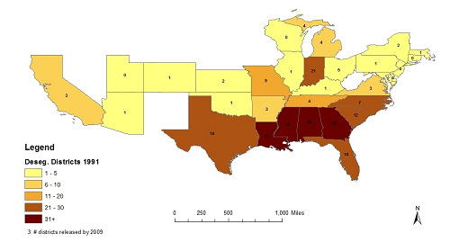

```{R, setup, include = F}
library(pacman)
p_load(broom, tidyverse, ggplot2, ggthemes, viridis, data.table, dplyr, tidyr, estimatr, lubridate, knitr, parallel, lfe, lme4, haven, weights)

# Define color
red_pink <- "#e64173"
turquoise <- "#20B2AA"
orange <- "#FFA500"
red <- "#fb6107"
blue <- "#3b3b9a"
green <- "#8bb174"
grey_light <- "grey70"
grey_mid <- "grey50"
grey_dark <- "grey20"
purple <- "#6A5ACD"
slate <- "#314f4f"
# Dark slate grey: #314f4f

# Knitr options
opts_chunk$set(
  comment = "#>",
  fig.align = "center",
  fig.height = 7,
  fig.width = 10.5,
  warning = F,
  message = F
)
opts_chunk$set(dev = "svg")
options(device = function(file, width, height) {
  svg(tempfile(), width = width, height = height)
})
options(knitr.table.format = "html")

```

# Agenda
## 1. Roadmap and Goals (10:00-10:10)
## 2. Discussion of Difference-in-Differences (DD) strategy (10:10-11:30)
## 3. Break (11:30-11:40)
## 4. Estimating DD effects in data (11:40-12:40)
## 5. Wrap-up (12:40-12:50)
- DARE #1
- Plus/Deltas & Clear/Murky

---
# Roadmap

```{r, causal_id, out.width = "100%", echo=F}
  knitr::include_graphics("causal_id.jpg")
```
---
# Goals

## 1. Describe threats to validity in difference-in-differences (DD) identification strategy and approaches to address these threats.

## 2. Using a cleaned dataset, estimate multiple DD specifications in R and/or Stata

---
# Cold Calling (1)

##Purpose
- Formative assessment
- Equitable distribution of class participation
- Shared accountability for deep understanding of complex and technical readings

--

##Structure
- All cold calls will be telegraphed
- Questions will come directly from document distributed prior to class
- Random draw (w. replacement) from class list
- Teaching staff will identify incomplete or incorrect responses and seek clarification
- Extension questions on a volunteer basis

---
# Cold Calling (2)

## Norms
- Questions posted by Wednesday PM
- Preparation is expected
- These are hard concepts, mistakes are expected
- Judgements on accuracy of responses are about the responses, not the individual
- Questions and response about learning, not performance

---
# Break

If you would like to follow parallel program, please open RStudio. 

Make sure you have the following packages installed and loaded (install `pacman` and then use the `p_load` command): `haven`, `tidyverse`, `broom`, `ggplot2`, `DT`, `data.table`, `lfe`, `ggcoefstats` and `weights`
---
#Programming in EDLD 650
##What you won't get :(
- Expert R programming guidance
- A heavy dose of data management and visualization strategies
- The most efficient code

--

##What you will get :)
- A review of the programming steps you should take as part of the **actual** research process
- *Some* model code for management and visualization
- Programming strategies and packages that can be used to estimate the causal inference techniques we wil study
- A community of knowledge programmers who will expand our knowledge base!


---
# Replicating Dynarski (2003)

Recall Dynarski's primary model (Eq. 2):

$$
\begin{align}
  y_i=\alpha + \beta(\text{FATHERDEC}_i \times \text{BEFORE}_i) + \delta \text{FATHERDEC}_i + \theta \text{BEFORE}_i + \upsilon_i
\end{align}
$$
--


**Let's try to fit this!**

---
#Reading in the data (1)

```{r, echo=TRUE}
dynarski <- read_dta("C:/Users/daviddl/OneDrive - University Of Oregon/Courses/EDLD 650/2_DD/ch8_dynarski.dta")  
  
head(dynarski)
```
---
#Reading in the data (2)

```{r, echo=TRUE, eval = T}
DT::datatable(dynarski[,c(1, 4:8)], fillContainer = FALSE, options = 
                list(pageLength = 7))
```


---
#Understanding the data (1)

```{r, echo=TRUE}
x <- select(dynarski, coll, hgc23, fatherdec, offer)

summary(x)
```
--
```{r, echo=TRUE}  
which(is.na(coll))
 
```

---
#Understanding the data (2)

```{r, echo=FALSE}
dynarski$fac_coll <- as.factor(dynarski$coll)
  dynarski$fac_coll <- factor(dynarski$fac_coll, levels = c(0,1),labels=c("No College", "College"))
dynarski$fac_fatherdec <- as.factor(dynarski$fatherdec)
  dynarski$fac_fatherdec <- factor(dynarski$fac_fatherdec, levels=c(0,1), labels=c("Father not deceased", "Father deceased"))
```

```{r, echo=TRUE}
college <- table(dynarski$fac_fatherdec, dynarski$fac_coll)
college
```
---
#Plot outcome data

```{r, echo=TRUE, fig.height=5}
hg <- ggplot(dynarski, aes(hgc23)) + geom_histogram(binwidth=1) 
  hg + scale_x_continuous(name="Highest-grade completed at 23", 
                          breaks=c(10, 12, 14, 16, 18, 20))

```
---
#Graphical DD

```{r, echo=TRUE, fig.height=4}
dynarski <- mutate(dynarski, post = ifelse(offer==1,0,1))

ggplot(dynarski, aes(post,coll)) + aes(color=factor(fatherdec)) + 
  stat_summary(fun.y=mean, geom="line") + labs(y="Pr(Coll)", 
  color="Father Deceased") + scale_x_discrete(name="Year", 
  breaks=c(0, 1), limits=c(0, 1), labels=c("0"= "pre-1981", "1"= "post-1981"))
```

---
#Estimate the basic DD (1)
Dynarski's original model:
$$
\begin{align}
  y_i=\alpha + \beta(\text{FATHERDEC}_i \times \text{BEFORE}_i) + \delta \text{FATHERDEC}_i + \theta \text{BEFORE}_i + \upsilon_i
\end{align}
$$
--
Murnane and Willet have renamed the variable to make clear that a value of 1 means individuals are eligible for aid, so:
$$
\begin{align}
  y_i=\alpha + \beta(\text{FATHERDEC}_i \times \text{OFFER}_i) + \delta \text{FATHERDEC}_i + \theta \text{OFFER}_i + \upsilon_i
\end{align}
$$
---
#Estimate the basic DD (2)

$$
\begin{align}
  y_i=\alpha + \beta(\text{FATHERDEC}_i \times \text{OFFER}_i) + \delta \text{FATHERDEC}_i + \theta \text{OFFER}_i + \upsilon_i
\end{align}
$$

```{r, echo=TRUE}
lm(coll ~ fatherdec*offer + fatherdec + offer, data=dynarski)
```
--
This doesn't quiet match, let's add the weights in...
---
#Estimate the basic DD (3)

$$
\begin{align}
  y_i=\alpha + \beta(\text{FATHERDEC}_i \times \text{OFFER}_i) + \delta \text{FATHERDEC}_i + \theta \text{OFFER}_i + \upsilon_i
\end{align}
$$
```{r, echo=TRUE}
lm(coll ~ fatherdec*offer + fatherdec + offer, data=dynarski, weights=wt88)
```
--
Pretty underwhelming output?
---
#Under the basic DD hood
```{r, echo=TRUE}
est_dynarski <- lm(coll ~ fatherdec*offer + fatherdec + offer, 
                   data=dynarski, weights=wt88)
est_dynarski %>% names()
```
--
```{r, echo=TRUE}
est_dynarski %>% tidy()
```
---
#Further under the hood
```{r, echo=TRUE}
summary(est_dynarski)
```
---
#Making a pretty table

```{r, results = 'asis', echo=TRUE}
library(stargazer)
stargazer(est_dynarski, type='html', single.row = T)
```
---
#Parallel trends assumption (PTA)?

##The end of desegregation
- In 1991, 480 school districts were under court desegregation order
- In following two decades, nearly half (215) released and returned to neighborhood assignment
- Timing of release, quasi-random

 .pull-left[
 ```{r, echo=F}
     
  ```
  ]
  
.pull-right[
```{r, echo=F}    
    knitr::include_graphics("release_timing.png")
```
]
--
What happened to educational outcomes? **Let's take advantage of observing districts over time!**

---
#The end of desegregation dataset
```{r, echo=F}
desegregation <- read_dta("C:/Users/daviddl/OneDrive - University Of Oregon/Courses/EDLD 650/2_DD/Class 2 Lecture Slides/edld_650_class_2_eepa_data.dta")
```

```{r, echo=T}
DT::datatable(desegregation[c(7:9, 13:15,319:321),c(1:3, 7, 10, 24)], 
              fillContainer = FALSE, height=175, options = list(pageLength = 9))
```

---
#Estimate the basic DD in panel data (1)
$$
\begin{align}
 \text{DROPOUT_BLACK} _{jt} = \beta_1 \text{UNITARY} _{jt} + \Gamma_j  + \Pi_t + \epsilon _{j}
\end{align}
$$
--
Take a minute to write down what this model does in words. Use the terms **mean effect**, **time series**,  **fixed effects** and **causal parameter of interest**. Share with your neighbor.

--
> The model takes advantage of **time series** data in which the black dropout rate in each district is observed at three points in time. The model regresses the black dropout rate in a **fixed effect** model in which observations are clustered in two dimensions: within district $(\Gamma_j)$ and also within time $(\Pi_t)$. Note: $\Gamma_j$ represents a vector of dummy indicators that take the value of one if observation *j* is equal to district *j* and zero otherwise. $\Pi_t$ represents a vector of dummy indicators that take the value of one if observation *j* is in time *t* (1990, 2000 or 2010). The $UNITARY_{jt}$ variable represents the **mean effect** of being observed after being declared unitary and is the **causal parameter of interest** reflecting the effect of being released from a desegregation order on the black dropout rate.

---
#Estimate the basic DD in panel data (2)

```{r, echo=T}
ols_unitary1 <- felm(sd_dropout_prop_b ~ unitary | year + leaid, data=desegregation, 
                  weights=desegregation$sd_t_1619_b)
summary(ols_unitary1)
```

---
#Addressing potential serial correlation
```{r, results='asis', echo=T}
ols_unitary2 <- felm(sd_dropout_prop_b ~ unitary | year + leaid | 0 | leaid, 
                    data=desegregation, weights=desegregation$sd_t_1619_b)
stargazer(ols_unitary1, ols_unitary2, type='html')
```

---
#Addressing parallel trends
$$
\begin{aligned}
 \text{DROPOUT_BLACK} _{jt} = & \beta_1 \text{UNITARY} _{jt} + \beta_2 (\text{UNITARY} \times \text{YEAR}) _{jt} + \\
    & \beta_3 \text{RUN_TIME} _{jt} + \Gamma_j  + \Pi_t + \epsilon _{j}
\end{aligned}
$$

--
What is this $\text{RUN_TIME} _{jt}$ and how do we code it?
--

```{r,echo=T}
desegregation <- desegregation %>%
  mutate(run_time = case_when(
    is.na(ffall) ~ -1, 
    !is.na(ffall) ~ (year - ffall) 
  ))

summary(desegregation$run_time)

```
---
#Look at RUN_TIME in the data
```{r, echo=F}
DT::datatable(desegregation[c(7:9, 13:15,319:321),c(1:3, 7, 10, 24:25)], 
              fillContainer = FALSE, height=175, options = list(pageLength = 9))
```
---

#Estimating parallel trends

```{r, echo=T}
ols_unitary_run <- felm(sd_dropout_prop_b ~ unitary + unitary*run_time + 
      run_time | year + leaid | 0 | leaid, data=desegregation, weights=
        desegregation$sd_t_1619_b)
summary(ols_unitary_run)
```
---
#Many names, one model

####1. Time-series DD with mean effects assumption relaxed
####2. A Comparative-Interrupted Time Series (C-ITS)

```{r, results='asis', echo=F}
ols_unitary_run <- felm(sd_dropout_prop_b ~ unitary + unitary*run_time + run_time | year + leaid | 0 | leaid, 
                    data=desegregation, weights=desegregation$sd_t_1619_b)
stargazer(ols_unitary1, ols_unitary2, ols_unitary_run, type='html', single.row=T)
```

---
#Strengths and limitations of C-ITS

##Strengths
- Takes advantage of full range of data
- Compared to mean-effect-only DD, allows differentiation of discontinuous jump vs. post-trend
- Permits modeling of fully flexible functional form (can include quadratic, cubic, quartic relationships, interactions and more!)
- Data-responsive approach
- Can be part of multiple DD specifications

--

##Challenges
- Encourages over-fitting
- Functional form dependent
- Risks generating unstable models

---

#A non-parametric approach (1)

What if, instead of assigning a particular parameter to UNITARY (either mean, linear or higher-order polynomial), we specified an entirely flexible model?

$$
\begin{aligned}
 \text{DROPOUT_HISP} _{jt} = & \beta_1 \text{pre10} _{jt} + \beta_2 \text{pre8} + \beta_3 \text{pre7} _{jt} +... \\
& +\beta_m \text{post0} _{jt} + ...+ \beta_n \text{postn} _{jt} + \Gamma_j  + \Pi_t + \epsilon _{j}
\end{aligned}
$$
--
Could also write as:
$$
\begin{align}
  \text{DROPOUT_HISP} _{jt} = \sum_{t=-10}^n 1(\text{t}=\text{t}_{j}^*)\beta_t+ \Gamma_j  + \Pi_t + \epsilon _{j}
\end{align}
$$
--
Think for a moment what this model does?

--

>The model adjusts its estimates of the mean rate of black dropout in district *j* by the mean rate of black dropout in year *t* across all districts. Then, it estimates what effect does being *t* years pre- or post-unitary have. The comparison in each of these $\beta$ s is to being never or not yet *UNITARY*.

---
#A non-parameteric approach (2)

```{r, echo=F}
desegregation <- mutate(desegregation, r_10minus=ifelse(run_time<=-10,1,0))
desegregation <- mutate(desegregation, r_10plus=ifelse(run_time>=10, 1, 0))

desegregation <- mutate(desegregation, r_7to9minus=case_when(
  run_time==-7 ~ 1,
  run_time==-8 ~ 1,
  run_time==-9 ~ 1,
  TRUE ~ 0))
desegregation <- mutate(desegregation, r_6to4minus=case_when(
  run_time==-6 ~ 1,
  run_time==-5 ~ 1,
  run_time==-4 ~ 1,
  TRUE ~ 0))
desegregation <- mutate(desegregation, r_3to2minus=case_when(
  run_time==-3 ~ 1,
  run_time==-2 ~ 1,
  TRUE ~ 0))
desegregation <- mutate(desegregation, r_0to2plus=case_when(
  run_time==0 ~ 1,
  run_time==1 ~ 1,
  run_time==2 ~ 1,
  TRUE ~ 0))
desegregation <- mutate(desegregation, r_3to5plus=case_when(
  run_time==3 ~ 1,
  run_time==4 ~ 1,
  run_time==5 ~ 1,
  TRUE ~ 0))
desegregation <- mutate(desegregation, r_6to9plus=case_when(
  run_time==6 ~ 1,
  run_time==7 ~ 1,
  run_time==8 ~ 1,
  run_time==9 ~ 1,
  TRUE ~ 0))

non_parametric <- felm(sd_dropout_prop_h ~ r_10minus + r_7to9minus + r_6to4minus +
                         r_3to2minus + r_0to2plus + r_3to5plus + r_6to9plus + 
                         r_10plus | year + leaid | 0 | leaid, data=desegregation,
                       weights=desegregation$sd_t_1619_h)
summary(non_parametric)
```

---

#The non-parametric approach visualized

```{r, echo=F, fig.height=5.5}
library(ggstatsplot)
ggcoefstats(x = non_parametric, point.color="red", stats.labels=F, caption.summary=F) +  
  theme_minimal() + geom_hline(aes(yintercept = 4.5), col="blue", lty="dashed") +
  labs(x="Change in Hispanic Dropout Rate", y="Relative Year", title="Figure 1. Event study of effects of end of desegregation on dropout rate") +
  scale_y_discrete(labels=c("-10 plus", "-7to-9", "-6to-4", "-3to-2", "Unitary+2", "+3to+5", "+6to+9", "10 plus")) + coord_flip()


```
---

#The non-parametric approach visualized

```{r, echo=F, fig.height=5.5}
library(ggstatsplot)
ggcoefstats(x = non_parametric, point.color="red", only.significant=T, caption.summary=F) +  
  theme_minimal() + geom_hline(aes(yintercept = 4.5), col="blue", lty="dashed") +
  labs(x="Change in Hispanic Dropout Rate", y="Relative Year", title="Figure 1. Event study of effects of end of desegregation on dropout rate") +
  scale_y_discrete(labels=c("-10 plus", "-7to-9", "-6to-4", "-3to-2", "Unitary+2", "+3to+5", "+6to+9", "10 plus")) + coord_flip()


```

--

>The end of desegregation efforts had a causal effect on the Hispanic dropout rate, resulting in a discontinuous increase and a persistent effect of between 3 and 9 percentage points.

---
#Code for event study

```{r, echo=T, fig.height=4}
library(ggstatsplot)
ggcoefstats(x = non_parametric, point.color="red", only.significant=T, 
  caption.summary=F) +  theme_minimal() + geom_hline(aes(yintercept = 4.5), 
  col="blue", lty="dashed") + labs(x="Change in Hispanic Dropout Rate", 
  y="Relative Year", title=
  "Figure 1. Event study of effects of end of desegregation on dropout rate") +
  scale_y_discrete(labels=c("-10 plus", "-7to-9", "-6to-4", "-3to-2", "Unitary+2", 
  "+3to+5", "+6to+9", "10 plus")) + coord_flip()


```
---
class: middle, inverse
#Wrap-up
---
# Goals

## 1. Describe threats to validity in difference-in-differences (DD) identification strategy and approaches to address these threats.

## 2. Using a cleaned dataset, estimate multiple DD specifications in R and/or Stata

---
#To-Dos

##Reading: Liebowitz, Porter & Bragg (2019)
- Critical to read the paper and answer a small set of questions as preparation for DARE
- *Further*: MHE: Ch. 5, 'Metrics: Ch. 5, Mixtape: 245-285


##DARE #1
- Due 9:00am, January 21 (different due date bc MLK Jr Day)
- Let's look at assignment
- Submit code and memo in response to questions
- Inform us of partners (or not)
- We are available for support!

##Research Project Proposal due 9am, 1/27
- Talk to us!

---
#Feedback

##Plus/Deltas

Front side of index card

##Clear/Murky

On back

---

class: middle, inverse
#Appendix: Stata code
---


#The Basic DD
```{r, echo=T}
#Estimating the basic DD
#reg coll fatherdec offer fatherdec#offer

#Estimating the basic DD with weights
#reg coll fatherdec offer fatherdec#offer [aweight=wt88]

```
---

#Estimating the basic DD in panel data
```{r, echo=T}
#Estimating panel data DD
#areg sd_dropout_prop_b unitary i.year [aweight=sd_t_1619_b], ///
#absorb(leaid)

#Estimating panel data DD with clustered standard errors
#areg sd_dropout_prop_b unitary i.year [aweight=sd_t_1619_b], ///
#absorb(leaid) vce(cluster leaid)
```
---

#Estimating linear trends in panel data
```{r, echo=T}
#Estimating panel data DD with clustered standard errors
#areg sd_dropout_prop_b unitary##run_time i.year ///
#[aweight=sd_t_1619_b], absorb(leaid) vce(cluster leaid)

#You can also use reghdfe if dealing with multi-dimensional fixed effects
#reghdfe sd_dropout_prop_b unitary##run_time ///
#[aweight=sd_t_1619_b], absorb(leaid year) vce(cluster leaid)
```

---

#The non-parametric approach

```{r, echo=T}
#The regression
#areg sd_dropout_prop_h r1-r8 i.year [aweight=sd_t_1619_h], ///
#absorb(leaid) vce(cluster leaid)

#Post-estimation
#nlcom (Ypre10+: _b[r1]) (Ypre7-9: _b[r2]) (Ypre4to6: _b[r3]) ///
#(Ypre2to3: _b[r4]) (Ypre1: _b[_cons] - _b[_cons]) (Y0to2: _b[r5]) ///
#(Ypost3to5: _b[r6]), (Ypost6to9: _b[r7], (Ypost10: _b[r8], post
#eststo event_dropout

#Plotting coefficients
#coefplot (event_dropout, ciopts(recast(rcap))), vertical yline(0) ///
#yscale(r(-0.15 0.15)) ylabel(-0.15(0.05)0.15) xline(4.5, lp(dash)) ///
#xlabel(1 "-10 plus" 2 "-7to-9" 3 "-4to-6" 4 "-2to-3" 5 "-1" 6 "0to2" ///
#7 "3to5" 8 "6to9" 9 "10+",labs(small)) xtitle("Time to Unitary") ///
#ytitle("Change in Hispanic Dropout Rate")
```


