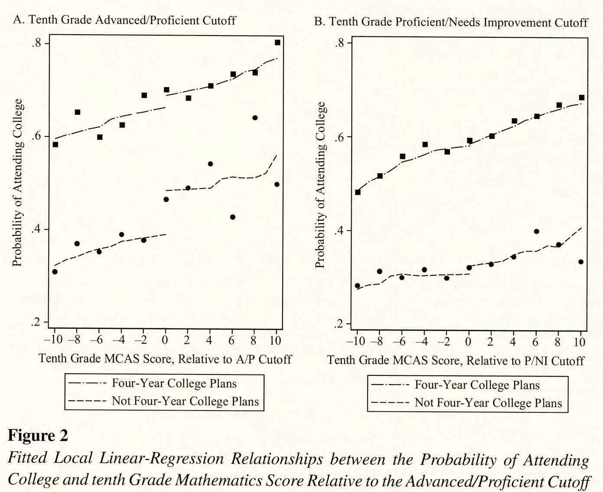
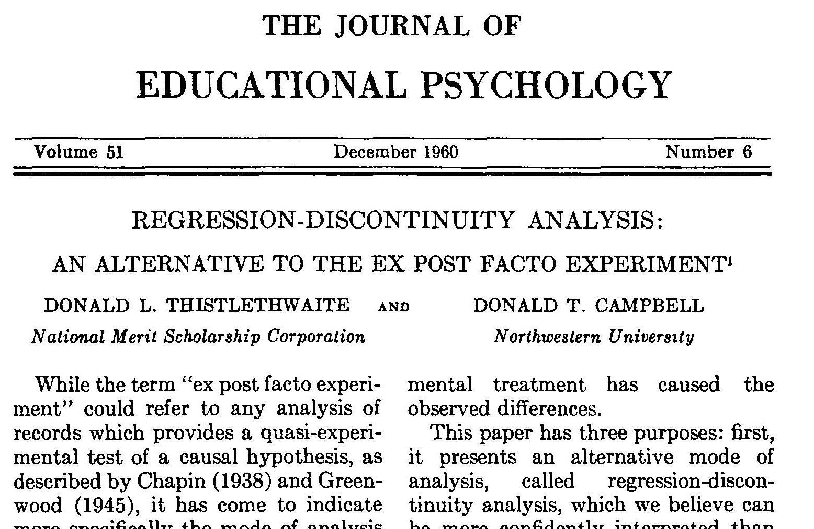
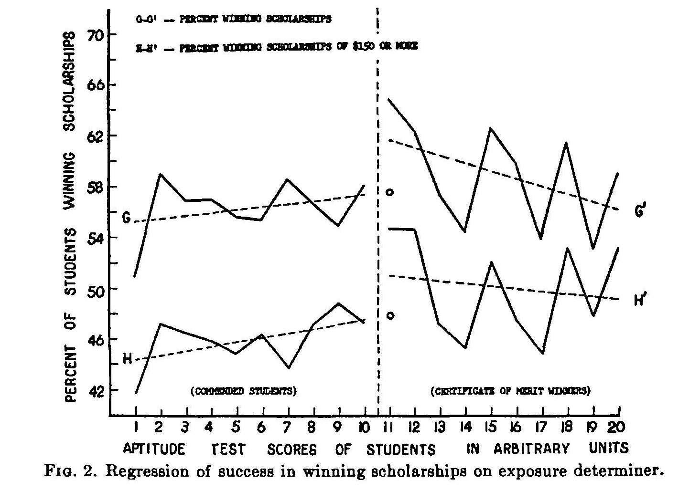

```{css, echo=F}
.inverse {
  background-color : #2293bf;
}
```

```{R, setup, include = F}
library(pacman)

p_load(here, tidyverse, DT, ggplot2, xaringan, knitr, kableExtra, modelsummary, stargazer, xaringanthemer, gganimate, ggthemes, fixest, haven)


i_am("slides/EDLD_650_3_RD_1.rmd")

# Define graphing colors
red_pink <- "#e64173"
turquoise <- "#20B2AA"
orange <- "#FFA500"
red <- "#fb6107"
blue <- "#3b3b9a"
green <- "#8bb174"
grey_light <- "grey70"
grey_mid <- "grey50"
grey_dark <- "grey20"
purple <- "#6A5ACD"
slate <- "#314f4f"

# Define text color
extra_css <- list(
  ".red"   = list(color = "red"),
  ".blue"  =list(color = "blue"),
  ".green" = list(color = "#8bb174"),
  ".purple" = list(color = "#6A5ACD"),
  ".red-pink" = list(color= "#e64173"),
  ".grey-light" = list(color= "grey70"),
  ".slate" = list(color="#314f4f"),
  ".small" = list("font-size" = "90%"),
  ".large" = list("font-size" = "120%"))


write_extra_css(css = extra_css, outfile = "my_custom.css")


# Knitr options
opts_chunk$set(
  comment = "#>",
  fig.align = "center",
  fig.height = 6.75,
  fig.width = 10.5,
  warning = F,
  message = F
)
# opts_chunk$set(dev = "svg")
# 
# options(device = function(file, width, height) {
#   svg(tempfile(), width = width, height = height)
# })

options(knitr.table.format = "html")

hook_output <- knit_hooks$get("output")
knit_hooks$set(output = function(x, options) {
  lines <- options$output.lines
  if (is.null(lines)) {
    return(hook_output(x, options))  # pass to default hook
  }
  x <- unlist(strsplit(x, "\n"))
  more <- "..."
  if (length(lines)==1) {        # first n lines
    if (length(x) > lines) {
      # truncate the output, but add ....
      x <- c(head(x, lines), more)
    }
  } else {
    x <- c(more, x[lines], more)
  }
  # paste these lines together
  x <- paste(c(x, ""), collapse = "\n")
  hook_output(x, options)
})


```

# Agenda

.large[
1. Roadmap and Goals (9:00-9:10)
2. Analyzing Liebowitz, Porter & Bragg (9:10-10:00)
3. How DARE you! (10:00-10:50)
  - Concepts and coding
  - Debrief
4. Break (10:50-11:00)
5. Regression discontinuity (11:00-11:40)
6. Wrap-up (11:40-11:50)
  - Research project proposal
  - Plus/Deltas & Clear/Murky
]
---
# Roadmap

```{r, echo=F}
  include_graphics("causal_id.jpg")
```

---
# Goals

### 1. Describe threats to validity in difference-in-differences (DD) identification strategy and approaches to address these threats.

### 2. Conduct applied difference-in-difference analysis and interpret these results.

### 3. Describe conceptual approach to regression discontinuity analysis

---
class: middle, inverse
# So random...

---
class: middle, inverse
# How DARE you?!?!

---
# DARE 1 review process

.large[
1. Form groups of 2-3 (not your DARE partner)
2. Independently review DARE #1 model response (10 min)
  - Take notes on where answers differ from model
  - Think about conceptual questions (modeling decisions, robustness checks, etc.) 
  - Think about presentation and language (what to leave in, what to leave out? how to describe results?)
3. Discuss in group conceptual and presentation questions (15 min)
4. Independently review code posted on course website (5 min)
5. Join partner (for solo authors join another author)
6. Discuss coding choices and questions (10 min)
7. Whole-group debrief (10 min)
  - Lingering questions
  - Process
]

---
class: middle, inverse

# Break
---
class: middle, inverse

# Discontinuities everywhere!

---

# Recall the basic set up of DD

```{r, echo=F, fig.height=3.75}
dynarski <- read_dta(here("data/ch8_dynarski.dta"))
dynarski <- mutate(dynarski, post = ifelse(offer==1,0,1))

dd <- ggplot(dynarski, aes(post,coll)) + aes(color=factor(fatherdec)) + 
      stat_summary(fun=mean, geom="line") + labs(y="Attend college (%)", 
      color="Father Deceased") + scale_x_discrete(name="Year", 
      breaks=c(0, 1), limits=c(0, 1), labels=c("0"= "pre-1981", "1"= "post-1981")) +
      #expand_limits(y=c(0.35, 0.6), x=c(-0.25, 1)) +
      annotate("text", x = 1, y = 0.45, label = "NOT deceased father", color = "#F8766D", size = 6) +
      annotate("text", x = 1, y = 0.39, label = "DECEASED father", color = "#00BFC4", size = 6) +
      theme_pander(base_size = 18) +
      theme(legend.position = "none") 
dd
```

--

Time (literally the passage of years) can be considered a .blue[**forcing variable**]--a measure, movement along which in one direction or another "forces" participants into treatment or control status.

---
# DD's cousin: C-ITS

**The Comparative-Interrupted Time Series approach:**
```{r, echo=F, fig.height=3.75}

desegregation <- read_dta(here("data/edld_650_class_2_eepa_data.dta"))
desegregation <- desegregation %>%
  mutate(run_time = case_when(
   !is.na(yrdiss) ~ (year - yrdiss),
   is.na(yrdiss) ~ -1 ## <-- this is funky, let's talk about it
  ))

unit <- filter(desegregation, !is.na(yrdiss) & !is.na(sd_dropout_prop_b))

ggplot(data=unit, aes(y=sd_dropout_prop_b, x=run_time, color=unitary)) +
  geom_point() +
  geom_smooth(data=subset(unit, unitary==0), method = lm, formula = y ~ x,  mapping = aes(weight = sd_t_1619_b)) +
  geom_smooth(data=subset(unit, unitary==1), method = lm, formula = y ~ poly(x, 2), mapping = aes(weight = sd_t_1619_b)) +
  geom_vline(aes(xintercept=0), col="black", lty="dashed", size=1) +
  coord_cartesian(ylim=c(-0.02, 0.45), expand=F) +
  labs(y="Black Dropout Rate", x="Relative Year") +
  theme_pander(base_size=20) +
  theme(legend.position = "none")

```


--
.small[In this way, DD may just be a specific application of a causal identification framework known as the **Regression Discontinuity (RD)**] design.<sup>1</sup>


.footnote[[1] In fact, many believe that repeated measures over time (a discrete ordered variable) are not divisible in same way as true continuous forcing variables are (e.g., test score, height, draft number). .red[*This is crucial to determine the credibility of identification.*]]

---
# C-ITS considered

### Strengths
- Takes advantage of full range of data
- Compared to mean-effect-only DD, allows differentiation of discontinuous jump vs. post-trend
- Permits modeling of fully flexible functional form (can include quadratic, cubic, quartic relationships, interactions and more!)
- Data-responsive approach

--

### Weaknesses
- Units on each side of discontinuity not .blue[*equal-in-expectation*] w/o other assumptions
- Encourages over-fitting; risks generating unstable models
- Estimates are functional-form dependent

--

.small[**Note that a fully-saturated C-ITS model (i.e., a model that estimates a coefficient on an indicator for each time period) is identical to an event study.**]


---
# Failing (passing) graduation test

.large[Massachusetts, like many other states (including Oregon until very recently) requires students to pass a test in order to graduate. **How does just passing (or failing affect students)?**]<sup>1</sup>

```{r, out.width = "45%", echo=F}
  
```

.footnote[[1] Papay, J.P., Murnane, R.J., & Willett, J.B. (2016). [The impact of test-score labels on human capital investment decisions.](http://jhr.uwpress.org/content/51/2/357) *Journal of Human Resources, 51*(2), 357-388.]

---
# Failing a graduation test

```{r, echo= F}
y0 <- function(x) 1 - exp(-x/100) 
y1 <- function(x) (1 - exp(-x/100)) + 0.15

set.seed(12345)
srd_df <- tibble(
  x = rnorm(n=300, mean=70, sd=15),
  y = ((x < 60) * y0(x)) + ((x >= 60) * y1(x)) + rnorm(length(x), sd=0.07)
) %>% mutate(
  y = between(y, 0, 1) * y + (y < 0) * 0 + (y > 1) * 1
) %>% filter(
  x != 60
)

lm_tmp <- lm(y ~ x + I(x>60), data = srd_df)
lm_fun <- function(x) predict(lm_tmp, data.frame(x = x))

gg_srd <- ggplot() +
geom_vline(xintercept = 60, color = slate, size = 1, alpha = 0.1) +

scale_x_continuous(
  "Test Score",
  lim = c(25,100)
) +
scale_y_continuous(
  "Probability of enrolling in college",
  lim = c(0,1),
   labels = scales::percent_format(accuracy = 1)
) +
geom_point(
  data = srd_df, aes(x = x, y = y, color = x >= 60),
  size = 2
) +
scale_color_manual(values = c(purple, red_pink)) +
theme_pander(base_size = 18) +
theme(legend.position = "none")

gg_srd
```
---
# Failing a graduation test

```{r, echo= F}

gg_srd2 <- ggplot() +
geom_vline(xintercept = 60, color = slate, size = 1, alpha = 0.1) +
stat_function(
  data = data.frame(x = c(0, 100)),
  aes(x = x),
  fun = lm_fun,
  xlim = c(33,59),
  color = purple,
  size = 1.5
) +
stat_function(
  data = data.frame(x = c(0, 100)),
  aes(x = x),
  fun = lm_fun,
  xlim = c(60.5,100),
  color = red_pink,
  size = 1.5
) +
scale_x_continuous(
  "Test Score",
  lim = c(25,100)
) +
scale_y_continuous(
  "Probability of enrolling in college",
  lim = c(0,1),
   labels = scales::percent_format(accuracy = 1)
) +
geom_point(
  data = srd_df, aes(x = x, y = y, color = x >= 60),
  size = 2
) +
scale_color_manual(values = c(purple, red_pink)) +
theme_pander(base_size = 18) +
theme(legend.position = "none")

gg_srd2
```
---
# Failing a graduation test

```{r, echo= F}

gg_srd2 +
  
  stat_function(
  data = data.frame(x = c(0, 100)),
  aes(x = x),
  fun = y0,
  xlim = c(60,100),
  color = purple,
  linetype = "dotted",
  size = 1.5
) +
stat_function(
  data = data.frame(x = c(0,100)),
  aes(x = x),
  fun = y1,
  xlim = c(33,59),
  color = red_pink,
  linetype = "dotted",
  size = 1.5
) 
```

---
# Failing a graduation test
```{r, echo= F}
gg_srd2 + 
geom_errorbar(
  data = tibble(x = 60, y0 = (1 - exp(-x/100)),  y1 = (1 - exp(-x/100)) + 0.15),
  aes(x = x, ymin = y0, ymax = y1),
  color = orange, size = 1.75, width = 0.1
)

```

---
# A different effect?

```{r, echo= F}
lm_tmp <- lm(y ~ poly(x,4) * I(x>60), data = srd_df)
lm_fun <- function(x) predict(lm_tmp, data.frame(x = x))

gg_srd3 <- ggplot() +
geom_vline(xintercept = 60, color = slate, size = 1, alpha = 0.1) +
stat_function(
  data = data.frame(x = c(0, 100)),
  aes(x = x),
  fun = lm_fun,
  xlim = c(33,59),
  color = purple,
  size = 1.5
) +
stat_function(
  data = data.frame(x = c(0, 100)),
  aes(x = x),
  fun = lm_fun,
  xlim = c(60.5,100),
  color = red_pink,
  size = 1.5
) +
scale_x_continuous(
  "Test Score",
  lim = c(25,100)
) +
scale_y_continuous(
  "Probability of enrolling in college",
  lim = c(0,1),
   labels = scales::percent_format(accuracy = 1)
) +
geom_point(
  data = srd_df, aes(x = x, y = y, color = x >= 60),
  size = 2
) +
scale_color_manual(values = c(purple, red_pink)) +
theme_pander(base_size = 18) +
theme(legend.position = "none")

gg_srd3

```

---
# Education FTW!<sup>1</sup>

```{r, out.width = "80%", echo=F}
  
```

.footnote[[1] Thistlethwaite, D. L., & Campbell, D. T. (1960). [Regression-discontinuity analysis: An alternative to the ex post facto experiment](https://psycnet.apa.org/record/1962-00061-001). Journal of Educational Psychology, 51(6), 309–317]

---
# The benefits of being recognized

```{r, out.width = "90%", echo=F}
  
```

---
# The basic set up in regression

Given a continuous forcing variable $S_{i}$ such that individuals receive a treatment $(D_{i})$ when $S_{i} \geq$ a cutoff $(C)$:  
  


$$Y_i=\beta_{0} + \beta_{1} S_{i} + \mathbb{1}(S_{i} \geq C)\beta_{2} + \varepsilon_{i}$$
  
--
.blue[**Can you explain what is happening in this regression?**]

--

.blue[**What about applied in a specific context?**]
  

$$p(COLL_{i}=1)= \beta_{0} + \beta_{1} TESTSCORE_{i} + 1(TESTSCORE_{i} \geq 60)\beta_{2} + \varepsilon_{i}$$

--
> This equation estimates a linear probability model, in which whether individuals attend college or not (expressed as a dichomotous indicator taking on the values of 0 or 1), is regressed on a linear measure of individual *i*'s test score $(TESTSCORE_{i})$ and a indicator variable that takes the value of 1 if individual *i* scored 60 or higher on the test. $\beta_{2}$ is the causal parameter of interests and represents the discontinuous jump in the probability (p.p.) of attending college (adjusting for test score) of scoring just above the pass score.

---

class: middle, inverse
# Wrap-up

---

# Goals

### 1. Describe threats to validity in difference-in-differences (DD) identification strategy and approaches to address these threats.

### 2. Conduct applied difference-in-difference analysis and interpret these results.

### 3. Describe conceptual approach to regression discontinuity analysis

---
# To-Dos

## Week 4: Regression Discontinuity

## Readings: 
- Murnane & Willet, Ch. 9
- Angrist & Lavy (1999)
- Ludwig & Miller (2007)
- *Further*: MHE: Ch. 6, 'Metrics: Ch. 4, Mixtape: Ch. 6

## Research Project Proposal due 9am, 1/28
- Talk to me!

---
# Feedback

## Plus/Deltas

Front side of index card

## Clear/Murky

On back

