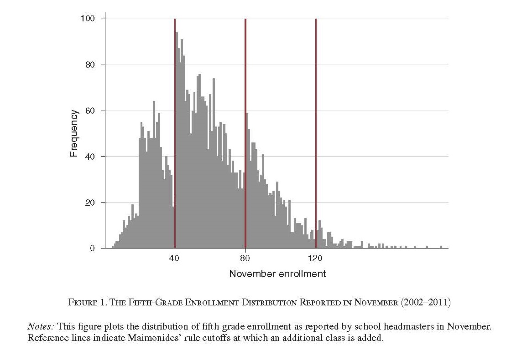
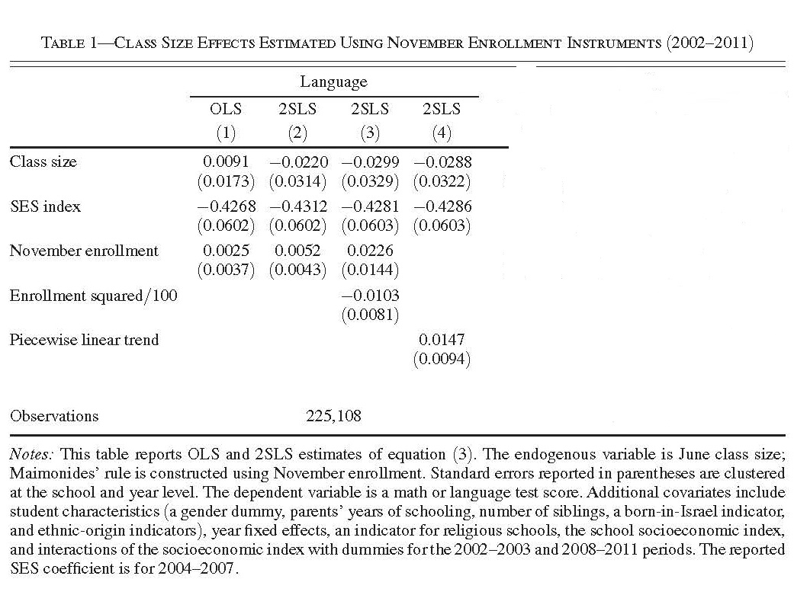

```{css, echo=F}
.inverse {
  background-color : #2293bf;
}
```

```{R, setup, include = F}
library(pacman)

p_load(here, tidyverse, DT, ggplot2, xaringan, knitr, kableExtra, modelsummary, stargazer, xaringanthemer, gganimate, ggthemes, fixest, haven)


i_am("slides/EDLD_650_4_RD_2.rmd")

# Define graphing colors
red_pink <- "#e64173"
turquoise <- "#20B2AA"
orange <- "#FFA500"
red <- "#fb6107"
blue <- "#3b3b9a"
green <- "#8bb174"
grey_light <- "grey70"
grey_mid <- "grey50"
grey_dark <- "grey20"
purple <- "#6A5ACD"
slate <- "#314f4f"

# Define text color
extra_css <- list(
  ".red"   = list(color = "red"),
  ".blue"  =list(color = "blue"),
  ".green" = list(color = "#8bb174"),
  ".purple" = list(color = "#6A5ACD"),
  ".red-pink" = list(color= "#e64173"),
  ".grey-light" = list(color= "grey70"),
  ".slate" = list(color="#314f4f"),
  ".small" = list("font-size" = "90%"),
  ".large" = list("font-size" = "120%"))


write_extra_css(css = extra_css, outfile = "my_custom.css")


# Knitr options
opts_chunk$set(
  comment = "#>",
  fig.align = "center",
  fig.height = 6.75,
  fig.width = 10.5,
  warning = F,
  message = F
)
# opts_chunk$set(dev = "svg")
# 
# options(device = function(file, width, height) {
#   svg(tempfile(), width = width, height = height)
# })

options(knitr.table.format = "html")

hook_output <- knit_hooks$get("output")
knit_hooks$set(output = function(x, options) {
  lines <- options$output.lines
  if (is.null(lines)) {
    return(hook_output(x, options))  # pass to default hook
  }
  x <- unlist(strsplit(x, "\n"))
  more <- "..."
  if (length(lines)==1) {        # first n lines
    if (length(x) > lines) {
      # truncate the output, but add ....
      x <- c(head(x, lines), more)
    }
  } else {
    x <- c(more, x[lines], more)
  }
  # paste these lines together
  x <- paste(c(x, ""), collapse = "\n")
  hook_output(x, options)
})


```

# Agenda

#### 1. Roadmap and Goals (9:00-9:10)
- Final thoughts on DARE #1
#### 2. Discussion Questions (9:10-10:20)
- Angrist and Lavy
- Ludwig and Miller
- Murnane and Willett

#### 3. Break (10:20-10:30)
#### 4. Applied regression discontinuity (10:30-11:40)
#### 5. Wrap-up (11:40-11:50)
- DARE #2 prep

---
# DARE #1: Last words

- You *all* did a good job; many of you have stellar skills in writing functions and/or familiarity with the `tidyverse`
- All DARE exemplars will be substantively consistent in sign/magnitude with paper. Sometimes identical.
  - If you see your results are different, you know that misalignment exists; .red[**that's okay!**]
  - Try to solve it, but if you can't write up what you have, note and interpret the differences

--
- For DARE #1, almost all errors were the result of either (a) creation of predictor variables or (b) model mis-specification
  - The first is going to happen, review and learn from your mistake
  - In the second case, review the model structure and think through what led to the different magnitude of the results
      + In the DD case, how does the TWFE structure result in the estimation of a series of 2x2 pre/post and treat/not comparisons?
      + What happens when you do not include year or state fixed effects?

--
- Non-causal and causal estimates shouldn't appear side-by-side in tables (w/o very good reason)


---
# Roadmap

```{r, echo=F}
  include_graphics("causal_id.jpg")
```

---
# Goals

### 1. Describe conceptual approach to regression discontinuity analysis

### 2. Assess validity of RD assumptions in applied context

### 3. Conduct and interpret RD analysis in simplified data

---
class: middle, inverse
# So random...

---
class: middle, inverse

# Break
---
# Recall the basic set up of the RD


```{r, echo= F}
y0 <- function(x) 1 - exp(-x/100) 
y1 <- function(x) (1 - exp(-x/100)) + 0.15

set.seed(12345)
srd_df <- tibble(
  x = rnorm(n=300, mean=70, sd=15),
  y = ((x < 60) * y0(x)) + ((x >= 60) * y1(x)) + rnorm(length(x), sd=0.07)
) %>% mutate(
  y = between(y, 0, 1) * y + (y < 0) * 0 + (y > 1) * 1
) %>% filter(
  x != 60
)

lm_tmp <- lm(y ~ x + I(x>60), data = srd_df)
lm_fun <- function(x) predict(lm_tmp, data.frame(x = x))

gg_srd <- ggplot() +
geom_vline(xintercept = 60, color = slate, size = 1, alpha = 0.1) +

scale_x_continuous(
  "Test Score",
  lim = c(25,100)
) +
scale_y_continuous(
  "Probability of enrolling in college",
  lim = c(0,1),
   labels = scales::percent_format(accuracy = 1)
) +
geom_point(
  data = srd_df, aes(x = x, y = y, color = x >= 60),
  size = 2
) +
scale_color_manual(values = c(purple, red_pink)) +
theme_pander(base_size = 18) +
theme(legend.position = "none")

gg_srd
```

---
# Failing a graduation test

```{r, echo= F}

gg_srd2 <- ggplot() +
geom_vline(xintercept = 60, color = slate, size = 1, alpha = 0.1) +
stat_function(
  data = data.frame(x = c(0, 100)),
  aes(x = x),
  fun = lm_fun,
  xlim = c(33,59),
  color = purple,
  size = 1.5
) +
stat_function(
  data = data.frame(x = c(0, 100)),
  aes(x = x),
  fun = lm_fun,
  xlim = c(60.5,100),
  color = red_pink,
  size = 1.5
) +
scale_x_continuous(
  "Test Score",
  lim = c(25,100)
) +
scale_y_continuous(
  "Probability of enrolling in college",
  lim = c(0,1),
   labels = scales::percent_format(accuracy = 1)
) +
geom_point(
  data = srd_df, aes(x = x, y = y, color = x >= 60),
  size = 2
) +
scale_color_manual(values = c(purple, red_pink)) +
theme_pander(base_size = 18) +
theme(legend.position = "none")

gg_srd2
```

---
# Failing a graduation test

```{r, echo= F}

gg_srd2 +
  
  stat_function(
  data = data.frame(x = c(0, 100)),
  aes(x = x),
  fun = y0,
  xlim = c(60,65),
  color = purple,
  linetype = "dotted",
  size = 1.5
) +
stat_function(
  data = data.frame(x = c(0,100)),
  aes(x = x),
  fun = y1,
  xlim = c(54,59),
  color = red_pink,
  linetype = "dotted",
  size = 1.5
) 
```

---
# Failing a graduation test
```{r, echo= F}
gg_srd2 + 
geom_errorbar(
  data = tibble(x = 60, y0 = (1 - exp(-x/100)),  y1 = (1 - exp(-x/100)) + 0.15),
  aes(x = x, ymin = y0, ymax = y1),
  color = orange, size = 1.75, width = 0.1
)

```

---
# The basic set up in regression

Given a continuous forcing variable $S_{i}$ such that individuals receive a treatment $(D_{i})$ when $S_{i} \geq$ a cutoff $(C)$:  
  

$$Y_i=\beta_{0} + \beta_{1} S_{i} + \mathbb{1}(S_{i} \geq C)\beta_{2} + \varepsilon_{i}$$
  
--
.blue[**Can you explain what is happening in this regression?**]

--

.blue[**What about applied in a specific context?**]
  

$$p(COLL_{i}=1)= \beta_{0} + \beta_{1} TESTSCORE_{i} + 1(TESTSCORE_{i} \geq 60)\beta_{2} + \varepsilon_{i}$$

--
> This equation estimates a linear probability model, in which whether individuals attend college or not (expressed as a dichomotous indicator taking on the values of 0 or 1), is regressed on a linear measure of individual *i*'s test score $(TESTSCORE_{i})$ and a indicator variable that takes the value of 1 if individual *i* scored 60 or higher on the test. $\beta_{2}$ is the causal parameter of interests and represents the discontinuous jump in the probability (p.p.) of attending college (adjusting for test score) of scoring just above the pass score.

---
# Let's practice!

Let's read in the modified Angrist & Lavy data and look at its characteristics:  


```{r, echo= T}
maimonides <- read_dta(here("data/ch9_angrist.dta"))
d <- select(maimonides, 
            read, size, intended_classize, observed_classize)
summary(d)

sapply(d, sd, na.rm=TRUE)
```

---
# Variation in the treatment?

```{r, echo= F, fig.height=5.5}
treat <- ggplot() +
  geom_jitter(data=maimonides, aes(x=size, y=observed_classize), color=grey_mid,alpha=0.4, shape=16) + 
  geom_line(data=maimonides, aes(x=size, y=intended_classize), color=red_pink, linetype="dashed", size = 1.5) +
  theme_pander(base_size = 18) + scale_x_continuous("Cohort size") +
  scale_y_continuous("Class Size")

treat

```

--

.blue[*Note that we are plotting the receipt of treatment (actual class size) against the forcing variable (cohort size). What assumption are we testing?*]

---
# Maimonides Rule Redux

Angrist, J. Lavy, V. Leder-Luis, J. & Shany, A. (2019). Maimonides' rule redux. *American Economic Review: Insights, 1*(3), 1-16.

.pull-left[
 ```{r, echo=F}
     
  ```
 
.blue[What does the picture on the left tell you about class size in Israel from 2002-2011?]
 ]
--
  
.pull-right[
```{r, echo=F}    
    
```

.blue[What does the picture on the right tell you about the effects of class size in Israel from 2002-2011?]
]


---
# Are RD assumptions met?
```{r, echo=F}
d <- filter(maimonides, size>=29 & size<=53)
```

```{r, echo=T}
bunch <- ggplot() +
    geom_histogram(data=d, aes(size), fill=blue, binwidth = 1) 
```

```{r, echo=F, fig.height=5.5}

bunch_polish <- bunch +
            geom_vline(xintercept = 40.5, color = slate, size = 1.5, alpha = 0.5) +       
            theme_pander(base_size = 18) + 
            scale_x_continuous("Cohort size", breaks=seq(29, 53, by = 1)) 
bunch_polish

```

---
# Are RD assumptions met?
```{r, echo=T, fig.height=5.5}
sort <- ggplot() +
  geom_boxplot(data=d, aes(x=as.factor(size), y=ses), 
  fill=red_pink, alpha=0.4)
```
```{r, echo=F, fig.height=5.5}
sort_polish <- sort +
  theme_pander(base_size = 20, base_family = "Fira Sans Book") +
  xlab("Cohort size") + scale_y_continuous("Family income")
sort_polish
```

---
# Are RD assumptions met?
```{r, echo=T, fig.height=5.5}
quantile <- ggplot() +
  geom_quantile(data=filter(d, size<41), aes(size, ses), quantiles=0.5, color=purple) + 
  geom_quantile(data=filter(d, size>=41), aes(size, ses), quantiles=0.5, color=red_pink)
```

```{r, echo=F, fig.height=5.5}
quantile_polish <- quantile +
  geom_vline(xintercept = 40.5, color = slate, size = 1.5, alpha = 0.5) +
  theme_pander(base_size = 18) +
  xlab("Cohort size") + scale_y_continuous("Family income") + expand_limits(y=c(-3,3))

quantile_polish
```
---

# Let's see if there's an effect
```{r, echo=F, fig.height=5.5}
fx <- ggplot() +
  geom_point(data=d, aes(x=size, y=read), color=blue, alpha=0.8, shape=16) +
  geom_vline(xintercept = 40.5, color = slate, size = 1.5, alpha = 0.5) +
  theme_pander(base_size = 18) +
  xlab("Cohort size") + ylab("Verbal score") 

fx
```

---
# Let's refresh on how RD works

$$READSCORE_{i} = \beta_{0} + \beta_{1} COHORTSIZE_{i} + 1(COHORTSIZE_{i} \geq 41)\beta_{2} + \varepsilon_{i}$$
--

Could also write this as:
$$READSCORE_{i} = \beta_{0} + \beta_{1} COHORTSIZE_{i} + \beta_{2} SMALLCLASS_{i} + \varepsilon_{i}$$


Can you explain the identification strategy as you would in your methods section (using *secular trend, forcing variable, equal in expectation, projecting across the discontinuity, ITT*)?

---
# Let's refresh on how RD works

> We estimate the effects of class size on individual *i*'s reading score. Specifically, we regress their test score outcome on whether the size of their grade cohort predicts that they will be assigned to a small class. We account for the secular relationship between test scores and cohort size by adjusting our estimates for the linear relationship between cohort size and test scores.

> Our identification strategy relies on the assumption that cohorts that differ in size by only a few students are equal in expectation prior to the exogenous assignment to a small class size $(D_{i}=1)$. Our modeling approach depends on our ability to project a smooth relationship between reading scores and cohort size across the discontinuity and then estimate the discontinuous effect of being quasi-randomly assigned to learn in smaller classes. Given that compliance with Maimonides Rule is imperfect, our approach models Intent-to-Treat estimates. Specifically, what is the effect on reading scores of being assigned by rule to a smaller class size? 

---
# Let's see if there's an effect

```{r, echo=T, fig.height=5}
d <- d %>% mutate(small = ifelse(size >= 41,TRUE,FALSE))

fx2 <- ggplot() + 
  geom_point(data=d, aes(x=size, y=read, colour=small), alpha=0.8, shape=16) 
```

```{r, echo=F, fig.height=5}
fx2_polish <- fx2 + 
  geom_vline(xintercept = 40.5, color = slate, size = 1.5, alpha = 0.5) +
  theme_pander(base_size = 18) + xlab("Cohort size") + ylab("Verbal score") + 
  scale_color_manual(values = c(purple, red_pink)) +
  theme(legend.position = "none")

fx2_polish
```

---
# Let's see if there's an effect

```{r, echo=T, fig.height=5}
bin<- d %>% group_by(size) %>% summarise(across(c("read", "small"), mean))

binned_plot <- ggplot() + 
  geom_point(data=bin, aes(x=size, y=read, colour=as.factor(small)), alpha=0.8, shape=16, size=3) 
```

```{r, echo=F, fig.height=5}
binned_polish <- binned_plot + 
  geom_vline(xintercept = 40.5, color = slate, size = 1.5, alpha = 0.5) + 
  theme_pander(base_size = 18) + xlab("Cohort size") + ylab("Verbal score") + 
  scale_color_manual(values = c(purple, red_pink)) +
  expand_limits(y=c(35,90)) +
  theme(legend.position = "none")

binned_polish

```

---
# Let's see if there's an effect

### Fitted lines:

```{r, echo=F, fig.height=5.5}

#The predicted values approach:
lm_tmp <- lm(read ~ size + I(size>40.5), data = d)
lm_fun <- function(size) predict(lm_tmp, data.frame(size = size))

binned_polish +
stat_function(
  data = data.frame(x = c(29, 53)),
  aes(size = size),
  fun = lm_fun,
  xlim = c(29,40.4),
  color = purple,
  size = 1.5
) +
stat_function(
  data = data.frame(x = c(29, 53)),
  aes(size = size),
  fun = lm_fun,
  xlim = c(40.6,53),
  color = red_pink,
  size = 1.5)
```

---
# Let's see if there's an effect 

### Different slopes:

```{r, echo=F, fig.height=5.5}
linear_fx <- fx2_polish + 
    geom_smooth(data=d, aes(x=size, y=read, colour=small), method = lm, se=FALSE)

linear_fx

```

---
# Let's see if there's an effect

### Change the bandwidth:
```{r, echo=F, fig.height=5.5}
linear_fx_band <- fx2_polish + 
  geom_smooth(data=filter(d, size>=36 & size<=46), aes(x=size, y=read, colour=small), method = lm, se=FALSE)

linear_fx_band
```

---
# Let's see if there's an effect

### Formal-ish:
```{r, echo=F, fig.height=5.5}
linear_fx_se <-fx2_polish + 
  geom_smooth(data=d, aes(x=size, y=read, colour=small), method = lm, se=TRUE)

linear_fx_se
```

---
# But it could be non-linear

### Formal-ish:
```{r, echo=F, fig.height=5.5}
non_linear_fx <- fx2_polish + 
  geom_smooth(data=d, aes(x=size, y=read, colour=small), method = lm, formula=y ~ poly(x,2), se=TRUE)

non_linear_fx
```

---
# Regression RD

Let's fit three different intent-to-treat (ITT) RD models, each of which assumes a different functional form for the forcing variable:

**Linear trend, same slope**
$$
\begin{aligned}
(1) READSCORE_i=\beta_0 + \beta_1 COHORTSIZE_i + \beta_2SMALLCLASS_i + \epsilon_i
\end{aligned}
$$

**Linear trend, different slope**
$$
\begin{aligned}
(2) READSCORE_i= &\beta_0 + \beta_1 COHORTSIZE_i + \beta_2SMALLCLASS_i + \\
&\beta_3 COHORTSIZE \times SMALLCLASS_i + \epsilon_i
\end{aligned}
$$

**Quadratic trend, same slope**
$$
\begin{aligned}
(3) READSCORE_i= &\beta_0 + \beta_1 COHORTSIZE_i + \beta_2 \text{COHORTSIZE}_{i}^2 + \\
& \beta_3SMALLCLASS_i + \epsilon_i
\end{aligned}
$$


---
# Results
```{r, results='asis', echo=F}
linear_const <- lm(read ~ size + I(size>40.5), d)
linear_diff <- lm(read ~ size * I(size>40.5), d)
quadratic <- lm(read ~ poly(size,2) + I(size>40.5), d)

modelsummary(list(linear_const, linear_diff, quadratic), 
             stars=T,
             coef_rename = c("(Intercept)" = "Intercept", "size" = "Intended size", "I(size > 40.5)TRUE" = ".red[**Intended small class**]",
                             "size:I(size > 40.5)TRUE" = "Size x Small", 
                             "poly(size, 2)1" = "Intended size", "poly(size, 2)2" = "(Intended size)^2"),
             gof_omit = "Adj|Pseudo|Log|Within|AIC|BIC|FE|Std|F"
             )

```
---
# Can you explain these results?

Models 1 and 3 seem sensibly connected to the graphical evidence, but Model 2 suggest that the effect of an offer of small class size is negative and an estimated whopping .red[-24.3 points lower reading scores]. What gives?

--

Recall the three models we fit:


$$
\begin{aligned}
(1) READSCORE_i=\beta_0 + \beta_1 COHORTSIZE_i + \beta_2SMALLCLASS_i + \epsilon_i
\end{aligned}
$$
$$
\begin{aligned}
(2) READSCORE_i= &\beta_0 + \beta_1 COHORTSIZE_i + \beta_2SMALLCLASS_i + \\
&\beta_3 COHORTSIZE \times SMALLCLASS_i + \epsilon_i
\end{aligned}
$$
$$
\begin{aligned}
(3) READSCORE_i= &\beta_0 + \beta_1 COHORTSIZE_i + \beta_2 \text{COHORTSIZE}_{i}^2 + \\
& \beta_3SMALLCLASS_i + \epsilon_i
\end{aligned}
$$

.small[We need to project the fitted values that our regression results predict *at the discontinuity*. The most straightforward way is to plug in the values for grade cohorts that are just under and over the threshold for being split in two by Maimonides' Rule using the estimated coefficients from the table on the previous slide.] .blue[Take Eq. 2 and try doing this for cohorts of 40 and 41, respectively.]

---
# Can you explain these results?

**Big class, grade cohort = 40**
$$
\begin{aligned}
\hat{READSCORE_i} = & 96.046 + (-0.725)(40) + (-24.346)(0) + (0.757)(40)(0) \\
& 96.046 + (-29) + 0 + 0 \\
& 67.046
\end{aligned}
$$

--

**Small Class, grade cohort=41**
$$
\begin{aligned}
\hat{READSCORE_i} = & 96.046 + (-0.725)(41) + (-24.346)(1) + (0.757)(41)(1) \\
& 96.046 + (-29.725) + (-24.346) + 31.037 \\
& 73.012
\end{aligned}
$$
--

So the predicted effect of being assigned to receive a smaller class when we allow the slopes to vary around the discontinuity is $73.012 - 67.046 = 5.9766$, or slightly larger than either the linear, constant slope or the quadratic specifications.

---
# Can you explain these results?

Now that we've harmonized our findings, can you explain these results in technically accurate and substantively clear ways?
--

> We estimate an effect of being assigned to a small class of between roughly 4 and 6 scale score points, depending on our assumptions about the nature of the underlying secular relationship between cohort size and reading performance. At the lower bound, these represent effects of around one half of a standard deviation (*SD*) unit. At the upper bound, these effects are as large as three-quarters of a standard deviation in the full sample.  These estimates are Local Average Treatment Effects (LATE), specific to being a member of a cohort whose size is just above or below the threshold for being divided into a smaller class.

---
# Extensions

1. Bandwidth variation (bias v. variance tradeoff)
  - Manual
  - Cross-fold validation (leave-one-out)
  - Imbens-Kalyanaraman (2009) Optimal Bandwidth Calculation
2. Higher-order polynomials
3. Non-parametric estimates
  - Local-linear approaches (LOESS)
  - Kernel (how to value points closest to cutoff)
  - Machine learning
4. Binning for visualizations
5. Diff-in-RD
6. Packages
  - R: `rddapp`, `rdd`, `rddtools`, `rdrobust`

---
# Just for fun...
```{r, echo=F, fig.height=5.5}
fx2_polish + geom_smooth(data=d, aes(x=size, y=read, colour=small), 
      method = loess, se=TRUE, linetype="dashed")

```
---
class: middle, inverse

# Wrap-up

---
# Goals

### 1. Describe conceptual approach to regression discontinuity analysis

### 2. Assess validity of RD assumptions in applied context

### 3. Conduct RD analysis in simplified data

---
# To-Dos

### Week 5: Regression Discontinuity II

### Readings: 
- Holden (2016)

### DARE #2
- Give me another chance!
- Due 1/31, 9:00am

### Project proposal
- Due 1/28, 9:00am

---
# Feedback

.large[.red[**Midterm Student Experience Survey**]]
