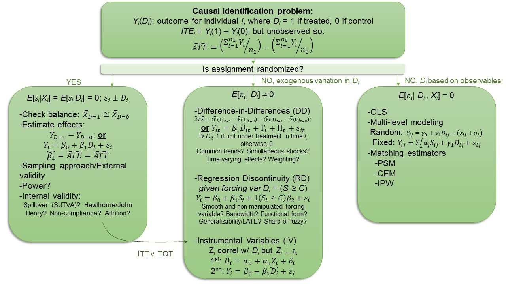
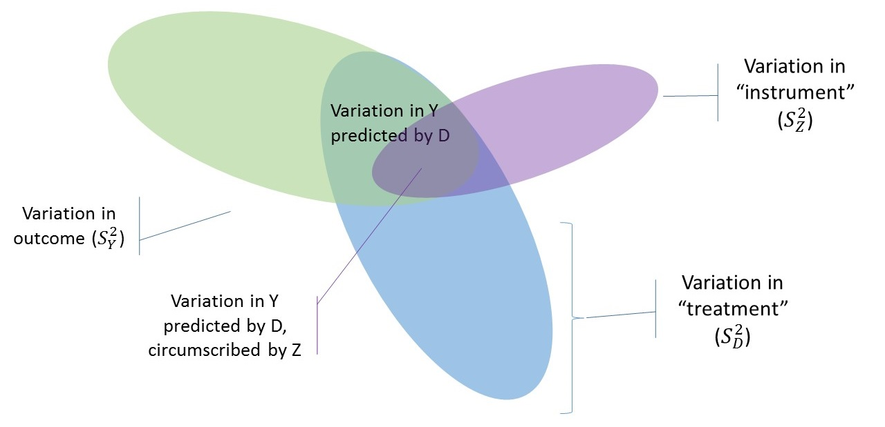

```{css, echo=F}
.inverse {
  background-color : #2293bf;
}
```

```{R, setup, include = F}
library(pacman)

p_load(here, tidyverse, DT, ggplot2, xaringan, knitr, kableExtra, modelsummary, stargazer, xaringanthemer, gganimate, ggthemes, fixest, haven)


i_am("slides/EDLD_650_5_IV_1.rmd")

# Define graphing colors
red_pink <- "#e64173"
turquoise <- "#20B2AA"
orange <- "#FFA500"
red <- "#fb6107"
blue <- "#3b3b9a"
green <- "#8bb174"
grey_light <- "grey70"
grey_mid <- "grey50"
grey_dark <- "grey20"
purple <- "#6A5ACD"
slate <- "#314f4f"

# Define text color
extra_css <- list(
  ".red"   = list(color = "red"),
  ".blue"  =list(color = "blue"),
  ".green" = list(color = "#8bb174"),
  ".purple" = list(color = "#6A5ACD"),
  ".red-pink" = list(color= "#e64173"),
  ".grey-light" = list(color= "grey70"),
  ".slate" = list(color="#314f4f"),
  ".small" = list("font-size" = "90%"),
  ".large" = list("font-size" = "120%"))


write_extra_css(css = extra_css, outfile = "my_custom.css")


# Knitr options
opts_chunk$set(
  comment = "#>",
  fig.align = "center",
  fig.height = 6.75,
  fig.width = 10.5,
  warning = F,
  message = F
)
# opts_chunk$set(dev = "svg")
# 
# options(device = function(file, width, height) {
#   svg(tempfile(), width = width, height = height)
# })

options(knitr.table.format = "html")

hook_output <- knit_hooks$get("output")
knit_hooks$set(output = function(x, options) {
  lines <- options$output.lines
  if (is.null(lines)) {
    return(hook_output(x, options))  # pass to default hook
  }
  x <- unlist(strsplit(x, "\n"))
  more <- "..."
  if (length(lines)==1) {        # first n lines
    if (length(x) > lines) {
      # truncate the output, but add ....
      x <- c(head(x, lines), more)
    }
  } else {
    x <- c(more, x[lines], more)
  }
  # paste these lines together
  x <- paste(c(x, ""), collapse = "\n")
  hook_output(x, options)
})


```

# Agenda

### 1. Roadmap and reflections (9:00-9:10)
### 2. Holden paper and DARE #2 (9:10-10:20)
  - Discussion questions
  - DARE debrief

### 3. Break (10:20-10:30)
### 4. Instrumental variables (10:30-11:40)
### 5. Wrap-up (11:40-11:50)

---
# Roadmap

```{r, echo=F}
  
```

---
# Mid-term feedback

### Keep doing
- Detailed feedback on assignments
- Accountability
- Well organized class materials and meaningful content

--

### Concerns and shifts
- Inappropriate level of challenge (though some signs of improvement)
- Insufficient scaffolding for DAREs
- Class questions too basic and lengthy, appear intended as completion check
- Foster better climate around discussion question participation
- Read and review paper before doing DARE

---
# Goals

### 1. Conduct and interpret RD analysis in simplified data

### 2. Assess the basic assumptions of the RD design

### 3. Describe the conceptual and simple mathematical approach for identifying causal effects using the instrumental variables approach

---
class: middle, inverse
# Class 5 Discussion Questions

---
class: middle, inverse
# You DARE-devils!

---
# DARE-d to do it!

Student examples in class...

---
class: middle, inverse

# Break
---
class: middle, inverse

# Instrumental variables

---
# The set-up

.blue[**Consider the following relationship we would like to estimate:**]

**The effect of a treatment $(D_{i})$ on an outcome of interest $(Y_{i})$:**
$$Y_{i} = \beta_{0} + \beta_{1}D_{i} + \varepsilon_{i}$$

--

**Now, let's apply this to a particular context:**
$$INC_{i} = \beta_{0} + \beta_{1}COLLEGE_{i} + \varepsilon_{i}$$
--

.red[**Don't be so crass!**]
--

$$VOTE_{i} = \beta_{0} + \beta_{1}COLLEGE_{i} + \textbf{X}_{i}\theta + \varepsilon_{i}$$
--

> Describe to your neighbor using the language of causal inference (*omitted variable bias, endogenous, causality, selection bias*) what is wrong with fitting this last regression in a nationally representative sample of adults for which we have records of their voting participation, highest level of education and rich demographic covariates $(\textbf{X}_{i})$.

---
# A mysterious solution

.blue[**Can we fix this without a sudden change across time and geography that we might term a "natural" experiment?**]

--

- What if we have data on another mysterious variable...?
- Let's call this variable an "instrument" and assign it the letter $Z_{i}$ for each individual $i$
- Let's suppose that it predicts treatment $(D_{i})$ and is itself exogenously determined


.large[.blue[**What would this mean???**]]

---
# A mysterious "instrument"

```{r, echo=F}
  
```

--

.pull-left[
**OLS estimate**: ratio of the area of *overlap of $Y$ and $D$* to the *total area of $D$*:
]
.pull-right[
$$\hat{\beta}_{1}^{OLS} = \frac{S_{YD}}{S_{D}^{2}}$$
]

---
# A mysterious "instrument"

```{r, echo=F}
  
```

--

.pull-left[
**IV estimate**: ratio of area of *overlap of $Y$ and $Z$* to area of *overlap of $D$ and $Z$*. Depends entirely on variation in $Z$ that predicts variation in $Y$ and $D$:
]

.pull-right[
$$\hat{\beta}_{1}^{IVE} = \frac{S_{YD}}{S_{DZ}}$$
a .blue[**Local Average Treatment Effect**]
]

---
# An instrument?

**But what serves as a helpful and valid instrument?**

--

### Valid instruments:
1. Instrument $(Z_{i})$ must be correlated with treatment $(D_{i})$, .red[*but*]
2. Instrument $(Z_{i})$ must be orthogonal $(\perp)$ to all other determinants of the outcome $(Y_{i})$ 
  - Another way of saying it must be uncorrelated with the residuals $(\varepsilon_{i})$
3. Instrument must be related to the outcome .red[*only*] through the treatment
  - This is known as the .blue[**exclusion restriction**] (we'll come back to this)

--

.blue[Can you think of things that might serve as good instruments in the example of college attendance ("treatment") and voting ("outcome")?]

---
# Two-stage least squares (2SLS) IV

### 1<sup>st</sup> stage:
Regress the endogenous treatment $(D_{i})$ on instrumental variable $(Z_{i})$ using OLS:
$$D_{i} = \alpha_{0} + \alpha_{1}Z_{i} + \nu_{i}$$

Obtain the *predicted values* of the treatment $(\hat{D_{i}})$ from this fit.<sup>[1]</sup>

--

### 2<sup>nd</sup> stage:
Regress the outcome $(Y_{i})$ on the predicted values of the treatment $(\hat{D_{i}})$ using OLS:
$$Y_{i} = \beta_{0} + \beta_{1}\hat{D_{i}} + \varepsilon_{i}$$


.footnote[[1] This doesn't get the standard errors correct, have to adjust *post-hoc*, but this is automated in all statistical software.]

---
# IV assumptions (re-stated)

Stage 1: $D_{i} = \alpha_{0} + \alpha_{1}Z_{i} + \nu_{i}$

Stage 2: $Y_{i} = \beta_{0} + \beta_{1}\hat{D_{i}} + \varepsilon_{i}$

### Assumptions:
1. .red-pink[Instrument must be correlated with the endogenous predictor (i.e., cannot be a **"weak" instrument**)]
2. Instrument must *not* be correlated with the residuals in the first stage equation $(\sigma_{Z\nu} = 0)$
3. Instrument must *not* be correlated with the residuals in the second stage equation $(\sigma_{Z\varepsilon} = 0)$

---
# IV assumptions 


### Assumptions:
1. .red-pink[Instrument must be correlated with the endogenous predictor (i.e., cannot be a **"weak" instrument**)]
2. Instrument must *not* be correlated with the residuals in the first stage equation $(\sigma_{Z\nu} = 0)$
3. Instrument must *not* be correlated with the residuals in the second stage equation $(\sigma_{Z\varepsilon} = 0)$

--

.red-pink[**Problems with #1:**]
- If $Z$ does not predict $D$, it would be a .blue[**"weak instrument"**]
- There would be no (minimal) variation in the obtained predicted values of the question predictor in the second stage
- The estimated regression slope would be *indeterminate* (or close to it)

---
# IV assumptions

### Assumptions:
1. Instrument must be correlated with the endogenous predictor (i.e., cannot be a **"weak" instrument**)
2. .red-pink[Instrument must *not* be correlated with the residuals in the first stage equation] $\color{red}{(\sigma_{Z\nu} = 0)}$
3. Instrument must *not* be correlated with the residuals in the second stage equation $(\sigma_{Z\varepsilon} = 0)$

--

.red-pink[**Problems with #2:**]
- If $Z$ is correlated with $\nu_{i}$, then $Z$ would be endogenous in the first stage equation
- The values of the question predictor would be replaced by biased predicted values, and the estimated regression coefficient would be biased in ways similar to biased multi-variate regression models

---
# IV assumptions 

### Assumptions:
1. Instrument must be correlated with the endogenous predictor (i.e., cannot be a **"weak" instrument**)
2. Instrument must *not* be correlated with the residuals in the first stage equation $(\sigma_{Z\nu} = 0)$
3. .red-pink[Instrument must *not* be correlated with the residuals in the second stage equation] $\color{red}{(\sigma_{Z\varepsilon} = 0)}$

--

.red-pink[**Problems with #3:**]

The statistical basis for IV of a potentially endogenous relationship is that: 

$$
\begin{aligned}
\beta_{1} = \left( \frac{\sigma_{YZ}}{\sigma_{DZ}} \right) - \left( \frac{\sigma_{\varepsilon Z}}{\sigma_{DZ}} \right)
\end{aligned}
$$

where $\sigma_{YZ}$ is the population covariance of outcome $Y$ and instrument $Z$, $\sigma_{\varepsilon Z}$ is the population covariation of residual $\varepsilon$ and instrument $Z$, and $\sigma_{DZ}$ is the population covariance of treatment $D$ and instrument $Z$.

---
# IV assumptions 

### Assumptions:
1. Instrument must be correlated with the endogenous predictor (i.e., cannot be a **"weak" instrument**)
2. Instrument must *not* be correlated with the residuals in the first stage equation $(\sigma_{Z\nu} = 0)$
3. .red-pink[Instrument must *not* be correlated with the residuals in the second stage equation] $\color{red}{(\sigma_{Z\varepsilon} = 0)}$


.red-pink[**Problems with #3:**]

The statistical basis for IV of a potentially endogenous relationship is that: 

$$
\begin{aligned}
\beta_{1} = \left( \frac{\sigma_{YZ}}{\sigma_{DZ}} \right) - \left( \frac{\sigma_{\varepsilon Z}}{\sigma_{DZ}} \right)
\end{aligned}
$$

.red[**as long as**]: (1) $\sigma_{\varepsilon Z} = 0$; and (2) $\sigma_{DZ} \neq 0$.

--

If $Z$ correlated with $\varepsilon$, then $\sigma_{\varepsilon Z} \neq 0$ and $\beta_{1}$ will be biased. 

---
# Exclusion restriction (visually)

**Those DAG-gone things come back...**

```{r, echo=F}
  
```

--

The .blue[**exclusion restriction**] states that the path by which the instrument influences the outcome goes **exclusively** through the endogenous predictor.

---
# Instrument examples

| Outcome             |  Intervention (treatment)  |  Omitted variables         | Instrument
|-------------------------------------------------------------------------------------------------
| Health              |  Smoking cigarettes        |  Other neg health behaviors| Tobacco taxes 
| Labor market success|  Assimilation              |  Ability; motivation       | Scrabble score of name
| Crime rate          |  Patrol hours              |  # of criminals            | Election cycles
| Female labor market |  Number of children        |  Family preferences; religiosity | First two children same-sex; twin births
| Conflicts           |  Economic growth           |  Simultaneous causality    | Rainfall `r emo::ji("smile")`

--

.small[Can you think of things that might serve as good instruments in the example of college and voting (**turn and talk**)? *Hint: trying to find something that exogenously predicts whether people will attend college but is unrelated to whether they will vote.*]

--

.small[*"A necessary but not a sufficient condition for having an instrument that can satisfy the exclusion restriction is if people are confused when you tell them about the instrument’s relationship to the outcome.” (Cunningham, 2021, p. 321)*]

---
# Very special instruments

| Outcome               |  Intervention (treatment)               |  Omitted variables                        | Instrument
|-----------------------------------------------------------------------------------------------------------------
| Test scores           |  Voucher-based private school attendance|  Non-compliance                           | Original NYSP lottery 
| Reading achievement   |  Class size                             |  Incomplete compliance to Maimonides' Rule| Rule-based assignment
| Reading achievement   |  Randomly assigned reading intervention |  Incomplete compliance; attrition         | Assignment to intervention


--

All instances in which assignment to treatment is *as-good-as random* but there is .blue[**imperfect compliance**].

---
# NY vouchers (Ch. 4 *MM*)

**Recall the NY Voucher experiment from Week 1**
- Low-income families *randomized* by lottery to **treatment** and **control** groups
  + Treatment families *received a voucher* to cover partial tuition costs at private schools;
  + Control families *received no voucher*
- Subsequent academic achievement measured for participating children:

--

$$READ_{i} = \beta_{0} + \beta_{1}VOUCHER_{i} + \textbf{X}_{i}\gamma + \varepsilon_{i}$$

--

- $\beta_{1}$ represents the causal effect of **voucher receipt** on reading achievement
- Because children were randomly assigned to the experimental conditions, predictor $VOUCHER_{i}$ is exogenous and children in the “Voucher” and “No Voucher” conditions are equal in expectation, prior to treatment.
- We can obtain an unbiased estimate of $\beta_{1}$ straightforwardly, using OLS regression analysis.

---
# But wait a minute...

While families were randomly assigned to "Voucher" and "No Voucher" conditions, **actual attendance** at private versus public schools was *not* randomly assigned.

--

.pull-left[
In first year of experiment, **5% of kids** whose families *did not receive vouchers* went to private school anyway
- Families wanted their kids taught in a religious setting
- Families wanted their kids out of public schools
- Families had greater financial and social resources
]

--

.pull-right[
In first year of experiment, **18% of kids** whose families *received vouchers* still went to public school
- Families lived too far from school and couldn't transport
- Families couldn't make up difference of private school fees
- Families didn't feel welcome in private school setting
]

--

As a result of these unobserved choices:
1. **Attendance** at public and private school was *not* assigned exogenously
2. Children who **attended** each kind of school were **not .blue[equal in expectation]** beforehand

---
# Same ole' endogeneity problem

Want to estimate:

$$READ_{i} = \beta_{0} + \beta_{1}PRIVATE_{i} + \textbf{X}_{i}\gamma + \varepsilon_{i}$$

but, unobserved characteristics (such as school accessibility, family resources, motivation, etc.) may determine whether the child goes to private school and also determine her outcomes. 

--

Because these **unobserved characteristics** are omitted as explicit predictors but affect the outcome, their effects are present in the residual $(\varepsilon_{i})$. 

--

Consequently, $PRIVATE_{i}$ will be correlated with the residuals and an OLS estimate of $\beta_{1}$ will be biased!

---
# An IV solution!

- Offer of voucher *was* .blue[**randomized and exogenous**]
- Offer of voucher likely to be correlated with **attendance** at a private or a public school because many families who got the voucher did in fact use it, and many families who didn’t sent their kids to public school
- Being randomized to voucher receipt is unlikely to predict the child’s ultimate achievement, *except through its impact on private school attendance*
  + No .blue[**third path**]!
  
--

We can use instrumental variable estimation, with attendance at private school $(PRIVATE_{i})$ as the endogenous question predictor and lottery-based receipt of a voucher $(VOUCHER_{i})$ as the instrument!

---
# An IV solution!

We can use instrumental variable estimation, with attendance at private school $(PRIVATE_{i})$ as the endogenous question predictor and lottery-based receipt of a voucher $(VOUCHER_{i})$ as the instrument!

.blue[**How would you write this?**]

--

**1<sup>st</sup> stage:**

$$PRIVATE_{i} = \alpha_{0} + \alpha_{1}VOUCHER_{i} + \alpha_{2}READ0_{i} + \delta_{i}$$

--

**2<sup>nd</sup> stage:**

$$READ1_{i} = \beta_{0} + \beta_{1} \hat{PRIVATE}_{i} + \beta_{2}READ0_{i} + \varepsilon_{i}$$

--

Note the inclusion of baseline reading scores $(READ0_{i})$ to improve precision and the inclusion of all covariates from Stage 1 in Stage 2!

--

$\beta_{1}$ is our causal parameter of interest and represents the estimated .blue[**Local Average Treatment Effect (LATE)**] of attending private school on lagged-score adjusted reading scores. .blue[*But to whom is it "local"? To whom do these estimates pertain?*]

---
## On which participants does IV depend?

This is an exemplar for any causal analysis that relies on an original randomized offer, but is followed by endogenous “take-up.” It also provides considerable insight into what an IV estimator is actually estimating:

--

.small[
|                       |  Never takers               |  Always takers                        | Compliers
|-----------------------------------------------------------------------------------------------------------------
|                        | *(never accept treatment)* | *(always seek out and obtain treatment)* | *(accept treatment if assigned; accept control if assigned)*
| **Voucher=1**          |  "Not treated"              |  "Treated"     | "Treated" 
| **Voucher=0**          |  "Not treated"              |  "Treated"     | "Not treated"
]

An IV estimate is often referred to as the effect of the .blue[**Treatement on the Treated (TOT)**].

--
Covariance algebra tells us that only the .blue[**compliers**] actually contribute to the IV estimate. IV is a LATE estimator, so only those participants whose actions respond to the instrument will participate in the estimate. .blue[**IV is the treatment effect for the compliers.**]

--

This approach assumes that there are no .blue[**defiers**]. These would be people who seek out private schools *only when they don't receive the voucher* (they would otherwise have gone to public) and vice-versa.


---
class: middle, inverse

# Wrap-up

---
# Goals

### 1. Conduct and interpret RD analysis in simplified data

### 2. Assess the basic assumptions of the RD design

### 3. Describe the conceptual and simple mathematical approach for identifying causal effects using the instrumental variables approach

---
# To-Dos

### Week 5: Instrumental variables
- Class visitor

### Readings: 
- Murnane & Willett (2011), *MM* Chapters 10-11
- Dee (2004) Are there civic returns to education?
- Angrist et al. (2016) Effects of Boston charter schools
- Further, *MHE*: Ch. 4; *'Metrics*: Ch. 3, *Mixtape*: Ch. 7

### Assignments Due:
- DARE #3: 2/14, 9:00am
- Talk to me about research project


---
# Feedback

## Plus/Deltas

Front side of index card

## Clear/Murky

On back
