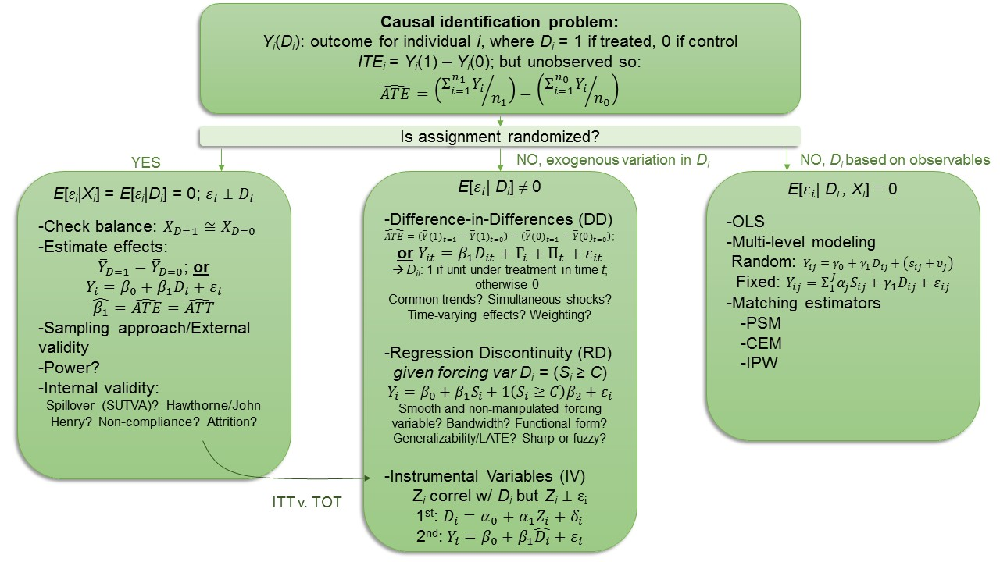
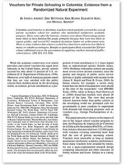

```{css, echo=F}
.inverse {
  background-color : #2293bf;
}
```

```{R, setup, include = F}
library(pacman)

p_load(here, tidyverse, DT, ggplot2, xaringan, knitr, kableExtra, modelsummary, stargazer, xaringanthemer, gganimate, ggthemes, fixest, haven, arsenal)


i_am("slides/EDLD_650_5_IV_1.rmd")

# Define graphing colors
red_pink <- "#e64173"
turquoise <- "#20B2AA"
orange <- "#FFA500"
red <- "#fb6107"
blue <- "#3b3b9a"
green <- "#8bb174"
grey_light <- "grey70"
grey_mid <- "grey50"
grey_dark <- "grey20"
purple <- "#6A5ACD"
slate <- "#314f4f"

# Define text color
extra_css <- list(
  ".red"   = list(color = "red"),
  ".blue"  =list(color = "blue"),
  ".green" = list(color = "#8bb174"),
  ".purple" = list(color = "#6A5ACD"),
  ".red-pink" = list(color= "#e64173"),
  ".grey-light" = list(color= "grey70"),
  ".slate" = list(color="#314f4f"),
  ".small" = list("font-size" = "90%"),
  ".large" = list("font-size" = "120%"))


write_extra_css(css = extra_css, outfile = "my_custom.css")


# Knitr options
opts_chunk$set(
  comment = "#>",
  fig.align = "center",
  fig.height = 6.75,
  fig.width = 10.5,
  warning = F,
  message = F
)
# opts_chunk$set(dev = "svg")
# 
# options(device = function(file, width, height) {
#   svg(tempfile(), width = width, height = height)
# })

options(knitr.table.format = "html")

hook_output <- knit_hooks$get("output")
knit_hooks$set(output = function(x, options) {
  lines <- options$output.lines
  if (is.null(lines)) {
    return(hook_output(x, options))  # pass to default hook
  }
  x <- unlist(strsplit(x, "\n"))
  more <- "..."
  if (length(lines)==1) {        # first n lines
    if (length(x) > lines) {
      # truncate the output, but add ....
      x <- c(head(x, lines), more)
    }
  } else {
    x <- c(more, x[lines], more)
  }
  # paste these lines together
  x <- paste(c(x, ""), collapse = "\n")
  hook_output(x, options)
})


```

# Agenda

#### 1. Roadmap and goals (9:00-9:10)
#### 2. Discussion Questions (9:10-10:20)
  - Murnane and Willett
  - Angrist et al. (x2)
  - Dee & Penner
  - Dee
  
#### 3. Break (10:20-10:30)
#### 4. Applied instrumental variables (10:30-11:40)
#### 5. Wrap-up (11:40-11:50)
  - DARE #3 prep
  - Plus/deltas

---
# Roadmap

```{r, echo=F}
  
```


---
# Goals

### 1. Describe conceptual approach to instrumental variables (IV) analysis

### 2. Assess validity of IV assumptions in applied context

### 3. Conduct IV analysis in simplified data and interpret results

---
class: middle, inverse
# So random...

---
class: middle, inverse

# Break

---
# The PACES experiment

.pull-left[
- Recall the PACES school voucher experiment ([Angrist et al. 2002](https://www.aeaweb.org/articles?id=10.1257/000282802762024629)) from *Methods Matter*, Chapter 11
- Lottery assignment for vouchers to attend private school in Colombia
- What is the .blue[**main outcome**]? 
- What is the .blue[**endogenous regressor**]?
]

.pull.right[
```{r, echo=F}

```
]

--
.red-pink[**Parameter of interest**]: *effect of using financial aid to attend private school*

---
# Let's replicate!

```{r, echo= T}
paces <- read.csv(here("./data/ch11_PACES.csv"))
DT::datatable(paces[,c(1:7)], fillContainer = FALSE, options = 
                list(pageLength = 5))

```

---
## First post-randomization task?

--

```{r, echo=F}
  
```

---
# Balance checks

### Examine by covariates:
$$\bar{X}_{D=1} \approxeq \bar{X}_{D=0}$$
```{r, results='asis', echo= T}
random <- arsenal::tableby(won_lottry ~ male + base_age, paces)
summary(random)
```

---
# Balance checks

### Omnibus $F$-test approach:

```{r, echo=T, output.lines=c(9:19), highlight.output=c(12)}
summary(lm(won_lottry ~ male + base_age, data=paces))
```

---
## A na&iuml;ve estimate of financial aid

```{r, results='asis', echo= T}
ols1 <- lm(finish8th ~ use_fin_aid, data=paces)
ols2 <- lm(finish8th ~ use_fin_aid + base_age + male, data=paces)
```

.small[
```{r, results='asis', echo=F}
stargazer(ols1, ols2, type='html', omit.stat = c("ser", "adj.rsq", "f"), 
    dep.var.caption="", dep.var.labels.include=F, omit=c("Constant"), 
    star.cutoffs=c(0.05, 0.01, 0.001), notes.align="l")
```
]

---
## What's wrong with na&iuml;ve approach?

--

> Only about 90 percent of lottery winners used the private school voucher to pay for private school and 24 percent of lotter losers found other sources of scholarships for which to pay for private school. There are endogenous differences in the expected outcomes of children from families who chose to both use the voucher and those who secured scholarship funding from sources outside the voucher lottery. The policy relevant question is how a public subsidy of private school might affect educational attainment for children from low-income families in Bogota, Colombia. The na&iuml;ve approach does not identify these effects but rather the combination of voucher subsidy and endogenous unobservables across families and individuals. 

---
# Some differences

```{r, results='asis', echo=T}
not_random <- arsenal::tableby(use_fin_aid ~ male + base_age, paces)
summary(not_random)
```
---
# How could IV address?


```{r, echo=F}
  include_graphics("iv2.jpg")
```

--

.pull-left[
**IV estimate**: ratio of area of *overlap of $Y$ and $Z$* to area of *overlap of $D$ and $Z$*. Depends entirely on variation in $Z$ that predicts variation in $Y$ and $D$:
]

.pull-right[
$$\hat{\beta}_{1}^{IVE} = \frac{S_{YD}}{S_{DZ}}$$
a .blue[**Local Average Treatment Effect**]
]

---
# Recall 2SLS set-up

### 1<sup>st</sup> stage:
Regress the endogenous treatment $(D_{i})$ on instrumental variable $(Z_{i})$:
$$D_{i} = \alpha_{0} + \alpha_{1}Z_{i} + \nu_{i}$$

Obtain the *predicted values* of the treatment $(\hat{D_{i}})$ from this fit.

--

### 2<sup>nd</sup> stage:
Regress the outcome $(Y_{i})$ on the predicted values of the treatment $(\hat{D_{i}})$:
$$Y_{i} = \beta_{0} + \beta_{1}\hat{D_{i}} + \varepsilon_{i}$$

--

.blue[Think about this in the Colombia PACES experiment context. What is the **main outcome**? What is the **endogenous regressor**? What is the **instrument**? Can you write the two-stage equation without consulting the next slide or book?]

---
# The PACES Scholarship

### 1<sup>st</sup> stage:
$$
\begin{align}
  USEFINAID_{i}=\alpha_{0} + \alpha_{1} WONLOTTERY_{i} + \nu_{i}
\end{align}
$$

--


### 2<sup>nd</sup> stage:
$$
\begin{align}
  FINISH8TH_{i}=\beta_{0} + \beta_1 \hat{USEFINAID}_{i} + \varepsilon_{i}
\end{align}
$$

--

.blue[What is the main outcome? What is the endogenous regressor? What is the instrument? What are the assumptions?]


---
# Outcome by lottery status
```{r, fig.height=5, echo= F}
mean <- paces %>% group_by(won_lottry) %>% summarize(mean8th = mean(finish8th))
ggplot(data=mean, aes(x=as.factor(won_lottry), y=mean8th)) + geom_col(fill=red_pink, 
      alpha=0.4) + theme_pander(base_size = 18) +
      xlab("Assigned treatment status") + scale_y_continuous("Finish 8th grade")

```

--

This represents an important substantive finding... .blue[**can you interpret what it is?**]

---
# A simple $t$-test

```{r, echo=T, highlight.output=c(5, 10:11)}
ttest <- t.test(finish8th ~ won_lottry, data=paces)
ttest
```

--


.blue[**Can you interpret what this means?**]

---
# Intent-to-Treat Estimates

```{r, echo= T}
itt1 <- lm(finish8th ~ won_lottry, data=paces)
itt2 <- lm(finish8th ~ won_lottry + base_age + male, data=paces)
itt3 <- lm(finish8th ~ won_lottry + base_age + male + 
             as.factor(school), data=paces)
```
.small[
```{r, results='asis', echo=F}
row <- tribble(~term,          ~'1',  ~'2', ~'3', 
               'School Fixed Effects', 'No', 'No', 'Yes')
attr(row, 'position') <- c(7)

modelsummary(list(itt1, itt2, itt3), 
         title = "Table 1. Intent-to-Treat Estimates of Winning the PACES lottery on 8th Grade Completion",
         stars=c('*' = 0.05, '**' = 0.01, '***' = 0.001),
         coef_omit = "(Intercept)|as.factor",
         coef_rename = c("won_lottry" = "Won Lottery", "base_age" = "Starting Age", "male" = "Male"),
         estimate = "{estimate}{stars}",
         gof_omit= "Adj|Pseudo|Log|Within|AIC|BIC|FE|Std|R2|F",
         add_rows = row,
         threeparttable= T,
         notes = c("Notes: The table displays coefficients from Equation X and standard errors in parentheses."),
         type='html')
```
]

---
# Intent-to-Treat Estimates

### .blue[What is our parameter of interest? Do these estimates represent that?]


.small[
```{r, results='asis', echo=F}
row <- tribble(~term,          ~'1',  ~'2', ~'3', 
               'School Fixed Effects', 'No', 'No', 'Yes')
attr(row, 'position') <- c(7)

modelsummary(list(itt1, itt2, itt3), 
         title = "Table 1. Intent-to-Treat Estimates of Winning the PACES lottery on 8th Grade Completion",
         stars=c('*' = 0.05, '**' = 0.01, '***' = 0.001),
         coef_omit = "(Intercept)|as.factor",
         coef_rename = c("won_lottry" = "Won Lottery", "base_age" = "Starting Age", "male" = "Male"),
         estimate = "{estimate}{stars}",
         gof_omit= "Adj|Pseudo|Log|Within|AIC|BIC|FE|Std|R2|F",
         add_rows = row,
         threeparttable= T,
         notes = c("Notes: The table displays coefficients from Equation X and standard errors in parentheses."),
         type='html')
```
]

---
## Implementing IV in regression

### Reminder of key assumptions:
1. Instrument correlated with endogenous predictor (.red-pink[no **"weak" instruments**])
2. Instrument not correlated with 1<sup>st</sup> stage residuals $(\sigma_{Z\nu} = 0)$
3. Instrument not correlated with 2<sup>nd</sup> stage residuals $(\sigma_{Z\varepsilon} = 0)$ and correlated with outcome only via predictor<sup>[1]</sup>
  + .red-pink[Exclusion restriction means **NO THIRD PATH!**]

--

### Practical considerations:
Can implement this various ways. Pedagogically, we'll implement 2SLS using the `fixest` package because it allows straightforward presentation of 1</sup>st</sup> stage results. This can also be done via `ivreg` and `iv_robust` in R.

.footnote[[1] Don't forget, .red-pink[**no defiers**] too.]

---
# IV Estimation

```{r, echo= T}
# Instrument with no covariates
# With only instrumented predictor and no covariates, 
# need to include a "1" in 2nd stage
tot1 <- feols(finish8th ~ 1 | use_fin_aid ~ won_lottry, data=paces)

# Instrument with covariates
# Note that these are automatically included in 1st stage
# Can include multiple instruments and multiple
# endogenous predictors
tot2 <- feols(finish8th ~ base_age + male | 
                          use_fin_aid ~ won_lottry, data=paces)


```

---
# IV results - First Stage
```{r, echo=T, highlight.output=13}
summary(tot2, stage = 1)
```

--
.small[
You will see some common rules of thumb about what makes for a strong instrument (e.g., $t_{F}>10$), but recent work has found that with $t$-ratios lower than 100 one should adjust critical value ([Lee et al., 2021](https://www.nber.org/papers/w29124)).
]

---
# IV results - Second Stage
```{r, echo=T}
summary(tot2)
```

.blue[**Can you interpret what this means?**]

---
# A taxonomy of IV estimates
```{r, echo=T}
# Include school fixed effects
tot3 <- feols(finish8th ~ base_age + male | as.factor(school) | 
              use_fin_aid ~ won_lottry, 
              vcov = "iid",  data=paces)

# Cluster-robust standard errors
tot4 <- feols(finish8th ~ base_age + male | as.factor(school) | 
              use_fin_aid ~ won_lottry, 
              vcov = ~ school, data=paces)
```
---
# Estimate voucher use effects
.small[
```{r, results='asis', echo=F}


mods <- list()
mods[['(1)']] <- tot1
mods[['(2)']] <- tot2
mods[['(3)']] <- tot3
mods[['(4)']] <- tot4

row <- tribble(~term,          ~'(1)',  ~'(2)', ~'(3)', ~'(4)',
               'School FE', 'No', 'No', 'Yes', 'Yes')
attr(row, 'position') <- c(7)

modelsummary(mods,
      title = "Table 2. Instrumental variable estimates of using financial aid to attend private school due to winning the PACES lottery on 8th grade completion",
      stars=c('*' = 0.05, '**' = 0.01, '***' = 0.001),
      coef_omit = "Int",
      gof_omit= "Adj|Pseudo|Log|Within|AIC|BIC|FE|Std|R2|F|Int",
      coef_rename = c("fit_use_fin_aid" = "Use Fin. Aid", "base_age" = "Starting Age", "male" = "Male"),
      add_rows = row,
      threeparttable= T,
      notes = c("The table displays coefficients from Equation X and standard errors in parentheses. Model 4 uses cluster-robust standard errors at school level.")
       ) 
      

```
]
 
---
# OLS, ITT and TOT estimates

.small[
```{r, results='asis', echo=F}

mod2 <- list()
mod2[['(1)']] <- ols2
mod2[['(2)']] <- itt2
mod2[['(3)']] <- tot1
mod2[['(4)']] <- tot2
mod2[['(5)']] <- tot4

row2 <- tribble(~term,          ~'(1)',  ~'(2)', ~'(3)', ~'(4)', ~'(5)',
               ' ', 'OLS', 'ITT', 'TOT', 'TOT', 'TOT',
               'School FE', 'No', 'No', 'No', 'No', 'Yes',
               'Student Chars.', 'Yes', 'Yes', 'No', 'Yes', 'Yes',
               'Clust. SEs', 'No', 'No', 'No', 'No', 'Yes'
              )   
attr(row2, 'position') <- c(1, 6, 7, 8)

modelsummary(mod2,
      title = "Table 3. Comparison of OLS, ITT and IV estimates of using financial aid to attend private school due to winning the PACES lottery",
      stars=c('*' = 0.05, '**' = 0.01, '***' = 0.001),
      coef_omit = "Int|male|base",
      gof_omit= "Adj|Pseudo|Log|Within|AIC|BIC|FE|Std|R2|F|Int",
      coef_rename = c("won_lottry" = "Win Lottery", "use_fin_aid" = "Use Fin. Aid", "fit_use_fin_aid" = "Use Fin. Aid"),
      add_rows = row2,
      threeparttable= T,
      notes = c("The table displays coefficients from Equation X and standard errors in parentheses.")
       ) 
      

```
]

---
# Interpretation of results

.small[The na&iuml;ve OLS estimates .large[.red-pink[understate]] the effects of a public voucher subsidy for private school attendance for over 125,000 children from low-income families in Bogota, Colombia. Our preferred estimates of the effect of voucher use on eighth-grade completion imply an increase in the on-time completion rate of 16 percentage points.]

--

.small[The estimates of the endogenous relationship between the use of financial aid to attend private school and school attainment (Model 1) imply that students who use any form of external scholarship are 12 percentage points more likely to complete eighth grade. In Model 2, we present results of winning an unbiased lottery to receive vouchers covering slightly more than half the cost of average private school attendance. We find that the offer of the voucher increased eighth-grade completion rates by just less than 11 percentage points. Finally, Models 3-5 present a taxonomy of Treatment-on-the-Treated estimates in which we use the randomized lottery as an instrument for the use of financial aid to attend private school. We find consistent effects 50 percent larger than the Intent-to-Treat estimates. These models are robust to the inclusion of baseline student characteristics, cohort fixed effects, and the clustering of standard errors at the level of randomization (within school).]

---
class: middle, inverse
# Synthesis and wrap-up

---
# Goals

### 1. Describe conceptual approach to instrumental variables (IV) analysis

### 2. Assess validity of IV assumptions in applied context

### 3. Conduct IV analysis in simplified data and interpret results


---
# Can you explain this figure?

```{r, echo=F}
  
```

---
# To-Dos

### Week 7: Instrumental Variables

### Readings: 
- Kim, Capotosto, Hartry & Fitzgerald (2011)

### Assignments Due
**DARE 3**
- Due 11:59pm, Feb. 18


---
# Feedback

## Plus/Deltas

Front side of index card

## Clear/Murky

On back

