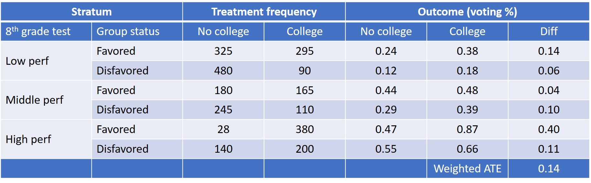

```{css, echo=F}
.inverse {
  background-color : #2293bf;
}
```

```{R, setup, include = F}
library(pacman)

p_load(here, tidyverse, DT, ggplot2, xaringan, knitr, kableExtra, modelsummary, stargazer, xaringanthemer, gganimate, ggthemes, fixest, haven, arsenal)


i_am("slides/EDLD_650_5_IV_1.rmd")

# Define graphing colors
red_pink <- "#e64173"
turquoise <- "#20B2AA"
orange <- "#FFA500"
red <- "#fb6107"
blue <- "#3b3b9a"
green <- "#8bb174"
grey_light <- "grey70"
grey_mid <- "grey50"
grey_dark <- "grey20"
purple <- "#6A5ACD"
slate <- "#314f4f"

# Define text color
extra_css <- list(
  ".red"   = list(color = "red"),
  ".blue"  =list(color = "blue"),
  ".green" = list(color = "#8bb174"),
  ".purple" = list(color = "#6A5ACD"),
  ".red-pink" = list(color= "#e64173"),
  ".grey-light" = list(color= "grey70"),
  ".slate" = list(color="#314f4f"),
  ".small" = list("font-size" = "90%"),
  ".large" = list("font-size" = "120%"))


write_extra_css(css = extra_css, outfile = "my_custom.css")


# Knitr options
opts_chunk$set(
  comment = "#>",
  fig.align = "center",
  fig.height = 6.75,
  fig.width = 10.5,
  warning = F,
  message = F
)
# opts_chunk$set(dev = "svg")
# 
# options(device = function(file, width, height) {
#   svg(tempfile(), width = width, height = height)
# })

options(knitr.table.format = "html")

hook_output <- knit_hooks$get("output")
knit_hooks$set(output = function(x, options) {
  lines <- options$output.lines
  if (is.null(lines)) {
    return(hook_output(x, options))  # pass to default hook
  }
  x <- unlist(strsplit(x, "\n"))
  more <- "..."
  if (length(lines)==1) {        # first n lines
    if (length(x) > lines) {
      # truncate the output, but add ....
      x <- c(head(x, lines), more)
    }
  } else {
    x <- c(more, x[lines], more)
  }
  # paste these lines together
  x <- paste(c(x, ""), collapse = "\n")
  hook_output(x, options)
})


```

# Agenda

### 1. Roadmap and goals (9:00-9:10)
### 2. The Kim et al paper and DARE #3 (9:10-10:20)
### 3. Break (10:20-10:30)
### 4. Matching (10:30-11:35)
### 5. Wrap-up (11:35-11:50)
  - To-dos and Plus/deltas

---
# Roadmap

```{r, echo=F}
  include_graphics("causal_id.jpg")
```


---
# Goals

### 1. Conduct IV analysis in simplified data and interpret results

### 2. Assess basic assumptions of IV design in an experimental setting with imperfect compliance

### 3. Describe the conceptual approach of using selection on observables to defend causal inferences about the effects of a treatment

---
class: middle, inverse
# Class 7 Discussion Questions

---
# DARE-d to do it!

Student examples in class...

---
class: middle, inverse

# Break

---
class: middle, inverse

# Matching

---
# Core causal inference challenge

### What is basic problem of drawing causal inferences from non-experimental (observational) data or data from a non-random subset within an experiment?

--

1. Treatment and non treatment groups are not .blue[*equal in expectation*], so it is difficult to claim .blue[*variation in treatment condition*] is driving .blue[*observed differences in outcomes*]
2. Sample is .blue[*no longer representative*] of the population (as originally defined)

--

$\rightarrow$ .red[**Biased estimate of treatment effect**]

--

Up until now, we have relied on being able to find an arguably .blue[*exogenous*] source of variation in likelihood of receiving the treatment...

--
.red[**but what if we can't find this???!!?**]

---
# Selection bias

Imagine: outcome $Y$ is a measure of later life success that depends on an earlier education attainment, $X$; *AND* that this is the actual, causal relationship between X and Y:

.pull-left[
**Hypothetical causal relation**
```{r, echo=F}

set.seed(123)

x <- rnorm(1000, mean = 12, sd=2)
y <- 1000*x + rnorm(length(x), sd = 5000)

ed <- as.data.frame(cbind(x,y))
ed <- ed %>% mutate(c = ifelse(x <11, 0, 1))

ed <- ed %>% mutate(y = case_when(y>0 ~ y,
                                  y<=0 ~ abs(y)))
p1 <- ggplot(ed, aes(x, y)) + 
      geom_point() +
      ylim(0,40000) +
      geom_smooth(method=lm, se=F) +
      theme_pander(base_size = 16)
p1

```
]

.pull-right[
**Observed relationship**
]

--

.small[
- but...in addition to the underlying causal relationship between X and Y, society consistently favors one group of individuals over another and in-so-doing, constrains some individuals' ability to access higher levels of educational attainment X.
- so...one group of individuals would consistently experience higher levels of attainment X *and* later life success Y
]

---
# Selection bias

Imagine: outcome $Y$ is a measure of later life success that depends on an earlier education attainment, $X$; *AND* that this is the actual, causal relationship between X and Y:

.pull-left[
**Hypothetical causal relation**
```{r, echo=F}

p1

```
]

.pull-right[
**Observed relationship**
```{r, echo=F}
ed <- ed %>% mutate(y2 = case_when(c==0 ~ y,
                                   c==1 ~ y + 7500))


ggplot(ed, aes(x, y2, color=factor(c))) + 
  geom_point() +
  ylim(0, 40000) +
  theme_pander(base_size = 16) +
  scale_discrete_manual(aesthetics = c("color"), values = c(purple, red_pink)) +
  theme(legend.position = "") +
  geom_smooth(method=lm, se=F)
```
]


.small[
- but...in addition to the underlying causal relationship between X and Y, society consistently favors one group of individuals over another and in-so-doing, constrains some individuals' ability to access higher levels of educational attainment X.
- so...one group of individuals would consistently experience higher levels of attainment X *and* later life success Y
]

---
# Selection bias

Imagine: outcome $Y$ is a measure of later life success that depends on an earlier education attainment, $X$; *AND* that this is the actual, causal relationship between X and Y:

.pull-left[
**Hypothetical causal relation**
```{r, echo=F}

p1

```
]

.pull-right[
**Observed relationship**
```{r, echo=F}
ggplot(ed, aes(x, y2)) + 
  geom_point() +
  ylim(0, 40000) +
  theme_pander(base_size=16) +
  geom_smooth(method=lm, se=F)
```
]


.small[
- however...we would not necessarily observe this constraint or know what this group is, and so we would only observe a .red[*biased*] relationship between X and Y
]

---
# A possible solution?

**Big idea**: if we were sure we knew that the only factor driving selection into treatment was individuals' membership in this group:
- We can ignore overall point cloud and refuse to estimate the biased Y|X slope
- Instead, conduct analysis within each subsidiary point clouds
  + Obtain estimates of treatment effect within each point cloud
  + Average to obtain overall *unbiased* estimate of treatment effect of more educational attainment

--

.pull-left[
**Ignore biased observed relationship**
```{r, echo=F}
ggplot(ed) + 
  geom_point(aes(x, y2, color=factor(c))) +
  ylim(0, 40000) +
  theme_pander(base_size = 16) +
  scale_discrete_manual(aesthetics = c("color"), values = c(purple, red_pink)) +
  theme(legend.position = "") +
  geom_smooth(aes(x, y2), method=lm, se=F, linetype="dashed", color=grey_mid)

```
]

.pull-right[
**Estimate treatment effect absent bias**
```{r, echo=F}
ggplot(ed, aes(x, y2, color=factor(c))) + 
  geom_point() +
  ylim(0, 40000) +
  theme_pander(base_size = 16) +
  scale_discrete_manual(aesthetics = c("color"), values = c(purple, red_pink)) +
  theme(legend.position = "") +
  geom_smooth(method=lm, se=F)
```
]

---
# Selection on observables

.large[This is the key conceptual basis for approaches such as: **stratification, weighting and matching**. They are used to remove "observed bias" from treatment effects estimated in observational data.]

.pull-left[ .small[
- This family of approaches relies on .blue[**selection on observables**] into treatment (*more on this later*)
- It is not a magical way of getting causal estimates when you don't have an identification strategy
- Like all the other methods we have studied, it requires a deep substantive understanding of why some are treated and others aren't
]
]

.pull-right[
```{r, echo=F}
ggplot(ed, aes(x, y2, color=factor(c))) + 
  geom_point() +
  ylim(0, 40000) +
  theme_pander(base_size = 16) +
  scale_discrete_manual(aesthetics = c("color"), values = c(purple, red_pink)) +
  theme(legend.position = "") +
  geom_smooth(method=lm, se=F)
```
]

--

.purple[**Let's take a quick look at how to stratify and generate propensity scores to provide some intuition for what these methods do...**]

---
# Stratification

```{r, echo=F}

```

--

.pull-left[ .small[
.blue[**Emerging issues:**]

Diminishing sample size within stratum
- Imprecise estimates
- Reduced power

In extreme, group may have no observations in a strata
- Lack of common support
- Can't estimate treatment effect
]
]

.pull-right[
```{r, echo=F}
ggplot(ed, aes(x, y2, color=factor(c))) + 
  geom_point() +
  ylim(0, 40000) +
  theme_pander(base_size = 16) +
  scale_discrete_manual(aesthetics = c("color"), values = c(purple, red_pink)) +
  theme(legend.position = "")
```
]

---
# Matching approach

The .blue[**conditional independence assumption (CIA)**] ([Rosenbaum & Rubin, 1983](https://www.jstor.org/stable/2335942?seq=1#metadata_info_tab_contents)) states that treatment is as-good-as random conditional on a known set of covariates. 

If .blue["selection on observables"] in fact happens, matching estimators take this literally. 

The basic idea: estimate a treatment effect only using observations with (nearly?) identical values of $\textbf{X}_{i}$. The CIA allows us to make a claim about causality within these groups.

We match untreated observations to treated observations using $\textbf{X}_{i}$ and calculate the average treatment effect by comparing $Y_{i}(1)$  to outcomes for "matched" untreated individuals $Y_{i}(0)$.


---
# The classic tradeoff

```{r, echo=F}

```

We want to minimize bias in our estimates by finding a match that most closely approximates each treated unit but we don’t want to overly restrict the definition of matching so as to require excluding too many units or producing a sample that does not reflect our originally defined population.

---
# Propensity scores (I)
### Phase I:

1. Investigate the selection process explicitly by fitting a "selection model":
  - Fit a logistic model, with treatment group membership as outcome, and predictors you believe describe the process of selection explicitly:
  
$$D_{i} = \frac{1}{1+e^{-\textbf{X}_{i} \theta_{i}}}$$
--
2. Use selection model to estimate fitted probability of selection into treatment $(\hat{p})$ for each participant
  - Output these “propensity scores” into your dataset
  - They summarize the probability that each participant will be selected into the treatment, given their values on the covariates.
  - They are the best non-linear composite of the covariates for describing selection into experimental conditions, given your choice of covariates.

---
# Propensity scores (II)
### Phase II:

1. Stratify the sample using the propensity scores:
    - Enforce overlap:
        + Drop control units with $\hat{p}$ below the minimum propensity score in the treatment group
        + Drop treated units with $\hat{p}$ above the maximum propensity score in the control group
    - Rule of thumb: as few as five strata may remove up to 90% of the observed bias
2. Within each stratum, check the balancing condition has been satisfied:
   - On the propensity scores themselves
   - On each of the covariates separately
3. If the balancing condition has not been met:
   - Re-stratify, combining or splitting strata, until balancing condition is met
   - If this fails, re-specify the selection model (nonlinear terms, interactions?) and start again
4. Once you have achieved balance, estimate treatment effect within each stratum, and average up

---
# Difference from OLS?

.pull-left[
```{r, echo=F}
ggplot(ed) + 
  geom_point(aes(x, y2, color=factor(c))) +
  geom_smooth(aes(x, y2, color=factor(c)), method=lm, se=F) +
  ylim(0, 40000) +
  theme_pander(base_size = 16) +
  scale_discrete_manual(aesthetics = c("color"), values = c(purple, red_pink)) +
  theme(legend.position = "") +
  geom_smooth(aes(x, y2), method=lm, se=F, linetype="dashed", color=grey_mid)
```
]
.pull-right[ .small[
1. It's not that different
2. Regression approaches make strong assumptions about the equivalence of treatment effects across different groups (can be solved with interactions or non-parametric approaches)...
3. including groups **for which there is no common support** (a case of predicting outside of data range and cannot be solved for with interactions)
4. Each additional covariate makes additional assumptions about equivalence of effects across groups (results in X-factorial potential interactions)
5. We’ve assumed that errors are homoscedastic across groups and pooled all of that variation to obtain a common standard error
]
]

---
# Good/bad candidates?

.large[**Remember, the only reason any of this is worth doing is if there is a clear case where (a) selection on the observables has occurred; and (b) the source of the selection can not be modeled via exogenous variation in treatment**]

.blue[ With a partner:
- Identify 2-3 examples of situations in which selection into treatment or the sample can be addressed via an approach from the matching family
- Identify 2-3 examples in which a matching approach would be suspect to persistent bias in estimates
]

---
# Two princes

```{r, echo=F}

```

.footnote[credit: not sure where original is from?]
---
# A family affair

### Matching approaches include:
- Stratification
- Propensity-Score Matching (PSM)
   + Nearest neighbor (Euclidian or Mahalanobis distance)
   + Kernel matching
   + Machine learning assisted matching
   + Calipers
   + With or without replacement
- Inverse Probability Weighting (IPW)
- Coarsened Exact Matching (CEM)
- Inexact Matching
- Synthetic controls in DD strategies
- Doubly-robust (e.g., matching and weighted) estimates
- And combinations of these and more…

--

...**the approach matters and requires close attention to procedure**

---
## Strengths/limitations of approaches
.small[

| Approach             |  Strengths                     |  Limitations
|------------------------------------------------------------------------
| Propensity-score nearest <br> neighbor matching w/ calipers and replacement | - Simulates ideal randomized experiment <br> - Limits dimensionality problem <br> - Calipers restrict poor matches <br> - Replacement takes maximal advantage of available data | - May generate poor matches <br> - Model dependent <br> Lacks transparency; PS in aribtrary units <br> - Potential for bias [(King & Nielsen, 2019)](https://www.cambridge.org/core/journals/political-analysis/article/abs/why-propensity-scores-should-not-be-used-for-matching/94DDE7ED8E2A796B693096EB714BE68B)
| Propensity-score stratification | - Simulates block-randomized experiment <br> - Limits dimensionality problem | - May produce worse matches than nearest neighbor <br> - Lacks transparency; stratum arbitrary
| Inverse probablity <br> (PS) matching | - Retains all original sample data <br> - Corrects bias of estimate with greater precision than matching/stratification | - Non-transparent/a-theoretical
| Coarsened Exact Matching | - Matching variables can be pre-specified (and pre-registered) <br> - Matching substantively driven <br> Transparent matching process <br> - Eliminates same bias as propensity score if SOO occurs | - May generate poor matches depending on how coarsened variables are <br> - May lead to disgarding large portions of sample

]
---
class: middle, inverse
# Synthesis and wrap-up


---
# Goals

### 1. Conduct IV analysis in simplified data and interpret results

### 2. Assess basic assumptions of IV design in an experimental setting with imperfect compliance

### 3. Describe the conceptual approach of using selection on observables to defend causal inferences about the effects of a treatment


---
# Roadmap

```{r, echo=F}
  include_graphics("causal_id.jpg")
```

---
# To-Dos

### Week 8: Matching

**Readings: **
- Murnane and Willett, Chapter 12
- Diaz & Handa - evaluation of Mexico's PROGRESA program
- Additional readings: Cunningham, Ch. 5; Dehejia & Wahba (2002); Iacus, King & Porro (2011); King et al. (2011); King & Nielsen (2019)

**Assignments Due**
- **DARE 4** (last one!!!)
    + Due 9:00am, Feb. 28

- **Final Research Project**
    + Presentation, March 8
    + Paper, March 18 (submit early [March 10] for feedback)

---
# Feedback

## Plus/Deltas

Front side of index card

## Clear/Murky

On back

